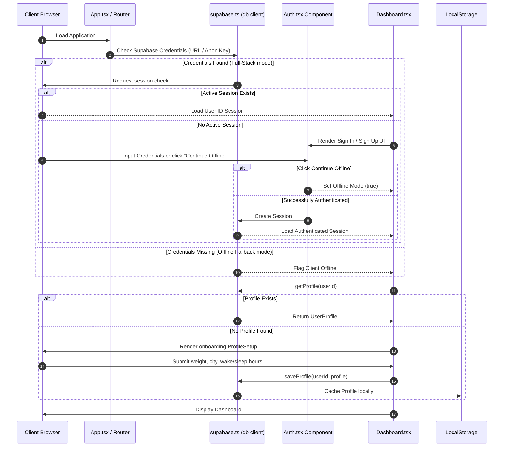
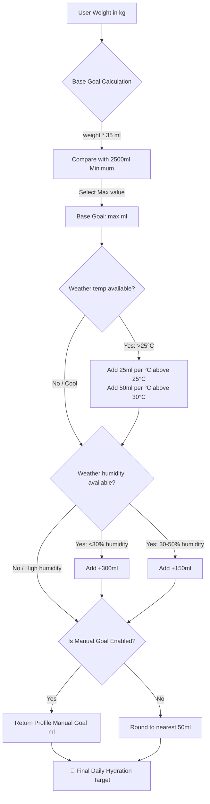
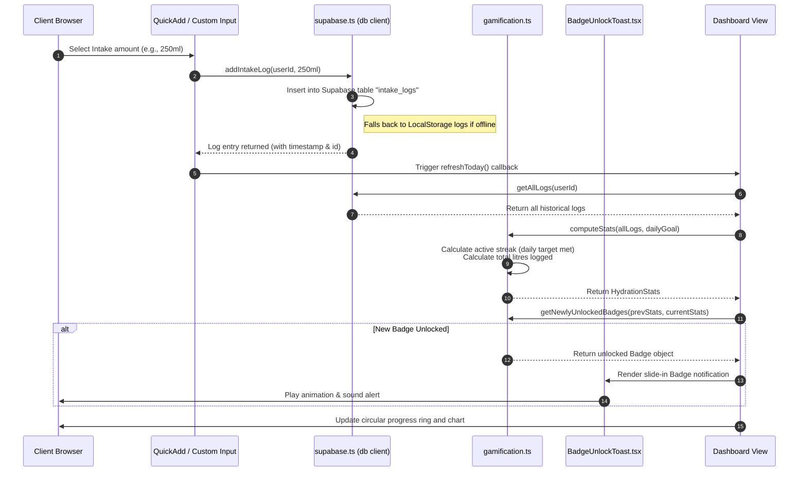

<p align="center">
  
</p>

<h1 align="center">💧 HydroSmart — Weather-Adaptive Hydration Tracker</h1>

<p align="center">
  <strong>A full-stack, weather-adaptive hydration system that personalizes daily water goals and schedules smart reminders based on body weight, real-time climate conditions, and historical intake metrics. Powered by React, TypeScript, and Supabase.</strong>
</p>

<p align="center">
  
  
  
  
  
  
  
  
</p>

---

## 📋 Table of Contents

- [🌟 Project Overview](#-project-overview)
- [🛠️ Tech Stack](#%EF%B8%8F-tech-stack)
- [🏗️ Code Structure & Folder Organization](#%EF%B8%8F-code-structure--folder-organization)
- [🔄 Workflow & Execution Flow](#-workflow--execution-flow)
  - [1. Application Boot & Auth Sequence](#1-application-boot--auth-sequence)
  - [2. Hydration Goal Calculation Logic](#2-hydration-goal-calculation-logic)
  - [3. Water Intake Logging & Badge Evaluation](#3-water-intake-logging--badge-evaluation)
- [🚀 Setup & Installation](#-setup--installation)
  - [1. Clone & Install Dependencies](#1-clone--install-dependencies)
  - [2. Supabase Integration Setup](#2-supabase-integration-setup)
  - [3. Run the Project Locally](#3-run-the-project-locally)
- [📖 Detailed Usage Instructions](#-detailed-usage-instructions)
- [🏆 Gamification & Milestones](#-gamification--milestones)

---

## 🌟 Project Overview

**HydroSmart** is an intelligent health utility designed to combat daily dehydration by replacing static hydration recommendations (such as "8 glasses a day") with a dynamic, **climate-aware hydration model**. The application adjusts daily fluid targets in real-time according to regional temperature, humidity, and individual physiological baselines.

### Key Capabilities:
* **Dynamic Hydration Algorithm**: Automatically evaluates weight baselines and applies real-time adjustments based on ambient meteorological data.
* **Weather-Adaptive Reminders**: Dynamically scales the notification frequency (from 30-minute intervals during extreme heat down to 2-3 hour intervals on cool days).
* **Supabase Authentication & Synchronization**: Provides cloud account syncing for seamless profiles, logs, and reminder state management across devices.
* **Graceful Local Fallback**: Operates as a 100% functional, local-first app using browser `localStorage` if database environment variables are omitted or offline.
* **Modern Gamification Framework**: Evaluates 14 unlockable milestone badges based on streaks, consistency indices, and volumetric logs.
* **Glassmorphic UI**: High-fidelity dashboard styled using Tailwind CSS, featuring spring-physics progress indicators and responsive layouts.

---

## 🛠️ Tech Stack

| Category | Technology | Description |
| :--- | :--- | :--- |
| **Frontend Core** | React 18.3 (TypeScript 5.8) | Component architecture, state management, and type-safe data pipelines. |
| **Build System** | Vite 5.4 | Fast bundler with Hot Module Replacement (HMR) and production minification. |
| **Database & Auth** | Supabase | User session management (Sign Up/In/Out) and remote PostgreSQL storage. |
| **Styling** | Tailwind CSS 3.4 | Utility-first responsive stylesheets and theme token definitions. |
| **Motion & Physics** | Framer Motion 12 | Spring-based animation parameters and fluid enter/exit transitions. |
| **Analytics Charting**| Recharts 2.15 | Responsive SVG charts displaying a rolling 7-day intake history. |
| **Data Fetching** | TanStack React Query 5 | Client-side caching and automated request retries for API communication. |
| **UI Components** | Radix UI + shadcn/ui | Headless, accessible primitives for dialogs, forms, and layouts. |
| **Meteorology API** | OpenWeatherMap | REST endpoint providing current temperatures and humidity parameters. |
| **Unit Testing** | Vitest 3.2 | Isolated unit test suites checking streaking logic, calculation modules, and time zones. |

---

## 🏗️ Code Structure & Folder Organization

The codebase is organized following a clean, modular structure dividing business logic, UI components, tests, and configuration assets:

```
hydrosmart/
├── .env.example                 # Template for database & API credentials
├── README.md                    # Visual setup, structure, and execution overview
├── architecture.md              # Detailed structural design and system patterns
├── projectdocumentation.md      # Full project breakdown and functional metrics
├── package.json                 # Project dependencies, dev packages, and build scripts
├── postcss.config.js            # PostCSS configuration for Tailwind compiler
├── tailwind.config.ts           # Design tokens, color palettes, and animations
├── tsconfig.json                # TypeScript project configuration rules
├── vite.config.ts               # Bundling, path aliasing, and dev-server parameters
├── vitest.config.ts             # Vitest test framework parameters
├── index.html                   # HTML entry point with meta tags and SEO configs
│
├── public/                      # Static assets served directly
│   ├── favicon.ico              # Browser bookmark icon
│   ├── logo.svg                 # Scalable application logo
│   └── robots.txt               # Crawler accessibility guidelines
│
└── src/                         # Application source files
    ├── main.tsx                 # Client entry bootstrap
    ├── App.tsx                  # App layout, error boundary, and router configuration
    ├── App.css                  # Core CSS overrides
    ├── index.css                # Tailwind directives and CSS variables (HSL tokens)
    │
    ├── components/              # React UI Components
    │   ├── ui/                  # Atom-level layout primitives (Shadcn components)
    │   │   ├── button.tsx       # Standard interactive button
    │   │   ├── input.tsx        # Styled form input field
    │   │   └── label.tsx        # Accessible input labeling
    │   ├── Auth.tsx             # Register / Login forms with offline option
    │   ├── BadgeUnlockToast.tsx # Achievement badge notification slide-in
    │   ├── Dashboard.tsx        # Container coordinator managing session, weather, and logs
    │   ├── ErrorBoundary.tsx    # Class component recovering from runtime exceptions
    │   ├── GamificationPanel.tsx# Renders streaks, totals, and unlocked achievements
    │   ├── ProfileSetup.tsx     # Wizard gathering user metric details
    │   ├── QuickAdd.tsx         # Fast water logging selectors with manual option
    │   ├── ReminderControl.tsx  # Toggle switch for notification permissions
    │   ├── WaterProgress.tsx    # SVG-based progress circle with spring-physics
    │   ├── WeatherCard.tsx      # Current weather status display and simulator overrides
    │   └── WeeklyChart.tsx      # Analytics charting with target-goal references
    │
    ├── lib/                     # Business Logic & Utility Modules
    │   ├── gamification.ts      # Streaking algorithm and badge definition engine
    │   ├── hydration.ts         # Math engine calculating daily goal and notification timings
    │   ├── notifications.ts     # Browser notification scheduling interface
    │   ├── supabase.ts          # Supabase client wrapper with transparent local-storage fallbacks
    │   ├── utils.ts             # Date and Tailwind-merge helpers
    │   └── weather.ts           # OpenWeatherMap client fetching real-time climate stats
    │
    ├── pages/                   # Route-level Page Containers
    │   ├── Index.tsx            # Main page loading Dashboard
    │   └── NotFound.tsx         # Custom 404 page
    │
    └── test/                    # Automated Test Suites
        ├── setup.ts             # Global test environments configuration
        ├── gamification.test.ts # Tests evaluating streaks, badges, and milestones
        └── hydration.test.ts    # Tests checking goals, intervals, and timezone groupings
```

---

## 🔄 Workflow & Execution Flow

### 1. Application Boot & Auth Sequence
This sequence details how the application checks for Supabase configuration, handles sessions, prompts login, and defaults to `localStorage` offline operations if necessary.



### 2. Hydration Goal Calculation Logic
The calculation engine dynamically adjusts fluid targets based on ambient inputs.



### 3. Water Intake Logging & Badge Evaluation
Logs are stored remotely in Supabase (if online) and mirrored locally, instantly triggering badge evaluation.



---

## 🚀 Setup & Installation

Follow these steps to configure and run HydroSmart locally on your machine.

### 1. Clone & Install Dependencies
Ensure you have [Node.js](https://nodejs.org/) (version 18 or above) installed.

```bash
# Clone the repository
git clone https://github.com/ramalokeshreddyp/hydrosmart-ai.git
cd hydrosmart-ai/aqua-smart-main

# Install dependencies using npm
npm install
```

### 2. Supabase Integration Setup
To configure account syncing, you need to connect a Supabase project.

1. Go to [Supabase](https://supabase.com/) and create a new project.
2. In the project dashboard, go to the SQL Editor and execute the following database schemas:

```sql
-- 1. Profiles Table (Linked to Supabase auth.users)
CREATE TABLE public.profiles (
  id UUID REFERENCES auth.users ON DELETE CASCADE PRIMARY KEY,
  name TEXT NOT NULL,
  weight NUMERIC NOT NULL,
  age INTEGER NOT NULL,
  city TEXT NOT NULL,
  wake_time TEXT NOT NULL DEFAULT '07:00',
  sleep_time TEXT NOT NULL DEFAULT '23:00',
  custom_interval INTEGER NOT NULL DEFAULT 60,
  weather_reminders_enabled BOOLEAN NOT NULL DEFAULT TRUE,
  channels TEXT[] NOT NULL DEFAULT ARRAY['in-app'],
  email TEXT,
  phone TEXT,
  manual_goal INTEGER,
  updated_at TIMESTAMP WITH TIME ZONE DEFAULT timezone('utc'::text, now())
);

-- Enable Row Level Security (RLS)
ALTER TABLE public.profiles ENABLE ROW LEVEL SECURITY;

CREATE POLICY "Users can manage their own profiles" 
  ON public.profiles FOR ALL 
  USING (auth.uid() = id);

-- 2. Water Intake Logs Table
CREATE TABLE public.intake_logs (
  id UUID PRIMARY KEY DEFAULT gen_random_uuid(),
  user_id UUID REFERENCES auth.users ON DELETE CASCADE NOT NULL,
  amount INTEGER NOT NULL,
  timestamp TIMESTAMP WITH TIME ZONE DEFAULT timezone('utc'::text, now())
);

ALTER TABLE public.intake_logs ENABLE ROW LEVEL SECURITY;

CREATE POLICY "Users can manage their own intake logs" 
  ON public.intake_logs FOR ALL 
  USING (auth.uid() = user_id);

-- 3. Reminder Logs Table
CREATE TABLE public.reminder_logs (
  id UUID PRIMARY KEY DEFAULT gen_random_uuid(),
  user_id UUID REFERENCES auth.users ON DELETE CASCADE NOT NULL,
  timestamp TIMESTAMP WITH TIME ZONE DEFAULT timezone('utc'::text, now()),
  temp NUMERIC NOT NULL,
  city TEXT NOT NULL,
  interval_minutes INTEGER NOT NULL,
  channels TEXT[] NOT NULL,
  action TEXT NOT NULL DEFAULT 'pending',
  amount_logged INTEGER
);

ALTER TABLE public.reminder_logs ENABLE ROW LEVEL SECURITY;

CREATE POLICY "Users can manage their own reminder logs" 
  ON public.reminder_logs FOR ALL 
  USING (auth.uid() = user_id);
```

3. Copy `.env.example` to create a `.env` file in the project root:
```bash
cp .env.example .env
```
4. Insert your project's credentials into `.env`:
```env
VITE_SUPABASE_URL=https://your-supabase-project-id.supabase.co
VITE_SUPABASE_ANON_KEY=your-supabase-anon-public-key
```

> [!NOTE]
> If `.env` is missing or variables are empty, HydroSmart automatically runs in **Offline Mode**, skipping server authentication and storing logs entirely in `localStorage`.

### 3. Run the Project Locally

```bash
# Start the development server
npm run dev

# Run unit tests to check functionality
npm run test

# Compile production bundle
npm run build
```
The development server will mount locally at `http://localhost:5173`.

---

## 📖 Detailed Usage Instructions

1. **Sign Up or Sign In**: Provide your email and password to log in. Click **"Continue Offline"** to bypass if testing without database configuration.
2. **Onboarding**: Fill in your weight (used for the baseline intake: 35ml per kg), default city (used to pull current weather coordinates), and awake periods.
3. **Log Intake**: Use Quick Add buttons (`150ml`, `250ml`, `500ml`) or log custom amounts.
4. **Weather Simulator**: Toggle between "Normal Office", "Cold Day", or "Heatwave" presets in the weather widget to see targets and interval times adjust immediately.
5. **Smart Reminders**: Grant notification permissions and turn on reminders. The scheduler calculates interval timings based on your active wake window and temperature.
6. **Analytics Panel**: Expand sections to inspect weekly bar charts, average volumes, and completion percentages.

---

## 🏆 Gamification & Milestones

HydroSmart evaluates 14 badges under 4 rarity tiers. Keep hydrated to unlock achievements:

* 🥉 **Bronze**:
  * **First Sip**: Log your first intake of the day.
  * **Halfway**: Log at least 50% of your daily goal.
  * **Consistent**: Log intake for 3 consecutive days.
  * **Week One**: Complete 7 consecutive tracking days.
  * **10L Total**: Reach 10,000ml of total logged intake.
* 🥈 **Silver**:
  * **Goal Crusher**: Hit your daily hydration target.
  * **On Fire**: Keep a streak of 7 consecutive days.
  * **50L Total**: Reach 50,000ml of total logged intake.
  * **Monthly**: Track daily intake for 30 consecutive days.
* 🥇 **Gold**:
  * **Overachiever**: Complete 150% of your calculated daily goal.
  * **10 Goals**: Meet your daily goal target 10 times.
  * **Unstoppable**: Maintain a streak of 14 consecutive days.
  * **Ocean**: Reach 100,000ml of total logged intake.
* 💎 **Diamond**:
  * **Legend**: Maintain a streak of 30 consecutive days.

---

<p align="center">
  Built with 💧 for a healthier, highly productive daily routine.
</p>
