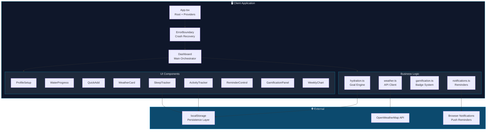
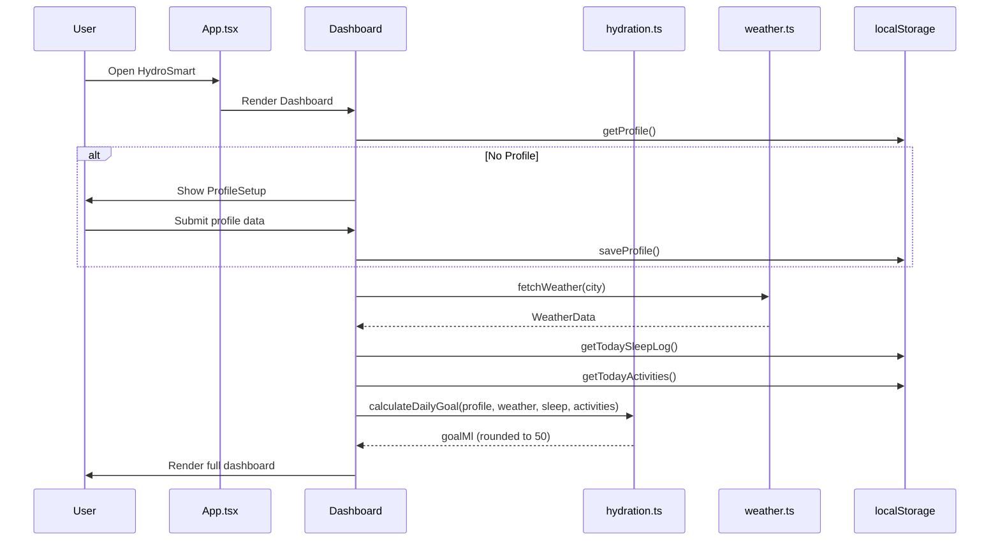
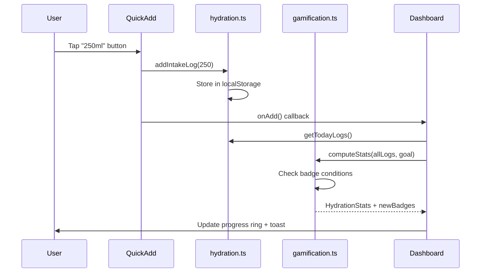
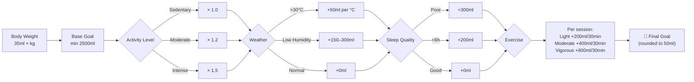

<p align="center">
  
</p>

<h1 align="center">💧 HydroSmart — Intelligent Hydration Tracker</h1>

<p align="center">
  <strong>A weather-adaptive, AI-powered hydration companion that personalizes your daily water intake goals based on real-time weather, sleep quality, exercise intensity, and body metrics.</strong>
</p>

<p align="center">
  
  
  
  
  
  
  
</p>

---

## 📋 Table of Contents

- [Project Overview](#-project-overview)
- [Key Features](#-key-features)
- [Tech Stack](#-tech-stack)
- [Architecture Overview](#-architecture-overview)
- [Execution Flow](#-execution-flow)
- [Project Structure](#-project-structure)
- [Getting Started](#-getting-started)
- [Usage Guide](#-usage-guide)
- [Hydration Algorithm](#-hydration-algorithm)
- [Gamification System](#-gamification-system)
- [Contributing](#-contributing)

---

## 🌟 Project Overview

**HydroSmart** solves the universal problem of inconsistent hydration by creating a **personalized, adaptive hydration plan** that evolves with your lifestyle. Unlike static water trackers, HydroSmart dynamically adjusts goals based on:

| Factor | Impact |
|--------|--------|
| 🌡️ **Real-time weather** | Temperature & humidity via OpenWeatherMap API |
| 🏋️ **Exercise intensity** | Light/Moderate/Vigorous → +200–600ml per session |
| 😴 **Sleep quality** | Poor sleep → +300ml; Short sleep (<6h) → +200ml |
| ⚖️ **Body metrics** | 35ml per kg body weight baseline |
| 🏃 **Activity level** | Sedentary (1.0×) to Intense (1.5× multiplier) |

---

## ✨ Key Features

```
┌─────────────────────────────────────────────────────────┐
│  🎯 Smart Goal Engine    │  Dynamic daily targets       │
│  🌦️ Weather Integration  │  Real-time climate adaptation │
│  😴 Sleep Tracking       │  Quality & duration logging   │
│  🏋️ Activity Tracking    │  Exercise-based adjustments   │
│  📊 Weekly Analytics     │  7-day intake visualization   │
│  🏆 Gamification         │  Badges, streaks, milestones  │
│  🔔 Smart Reminders      │  Browser notification system  │
│  📱 Responsive Design    │  Mobile-first, touch-ready    │
│  🛡️ Error Boundary       │  Graceful crash recovery      │
│  🎨 Glass Morphism UI    │  Modern, polished aesthetics  │
└─────────────────────────────────────────────────────────┘
```

---

## 🛠️ Tech Stack

| Category | Technology | Purpose |
|----------|-----------|---------|
| **Framework** | React 18 | Component-based UI with hooks |
| **Language** | TypeScript 5 | Type safety & developer experience |
| **Build Tool** | Vite 5 | Lightning-fast HMR & bundling |
| **Styling** | Tailwind CSS 3 | Utility-first responsive design |
| **Animations** | Framer Motion 12 | Fluid, physics-based transitions |
| **Charts** | Recharts 2 | Composable data visualization |
| **UI Components** | shadcn/ui + Radix | Accessible, headless primitives |
| **Routing** | React Router 6 | Client-side navigation |
| **State** | React Query + localStorage | Server state + persistence |
| **Weather API** | OpenWeatherMap | Global weather and humidity data |
| **Testing** | Vitest + Playwright | Unit & E2E testing |
| **Fonts** | Plus Jakarta Sans + Space Grotesk | Modern typography pair |

---

## 🏗️ Architecture Overview



---

## 🔄 Execution Flow

### Application Boot Sequence



### Water Intake Flow



### Hydration Goal Calculation



---

## 📁 Project Structure

```
hydrosmart/
├── public/
│   ├── placeholder.svg          # Default image placeholder
│   └── robots.txt               # SEO crawl directives
├── src/
│   ├── components/
│   │   ├── ui/                  # shadcn/ui primitives (40+ components)
│   │   ├── ActivityTracker.tsx   # Exercise logging with intensity
│   │   ├── BadgeUnlockToast.tsx  # Achievement notification popup
│   │   ├── Dashboard.tsx         # Main orchestrator component
│   │   ├── ErrorBoundary.tsx     # Global error recovery
│   │   ├── GamificationPanel.tsx # Badges, streaks, progress
│   │   ├── NavLink.tsx           # Navigation helper
│   │   ├── ProfileSetup.tsx      # Onboarding form
│   │   ├── QuickAdd.tsx          # Water intake buttons
│   │   ├── ReminderControl.tsx   # Notification settings
│   │   ├── SleepTracker.tsx      # Sleep quality & hours
│   │   ├── WaterProgress.tsx     # Circular progress ring
│   │   ├── WeatherCard.tsx       # Weather display widget
│   │   └── WeeklyChart.tsx       # 7-day bar chart
│   ├── lib/
│   │   ├── gamification.ts       # Badge engine & stats
│   │   ├── hydration.ts          # Core goal algorithm
│   │   ├── notifications.ts      # Browser push system
│   │   ├── utils.ts              # Tailwind merge utilities
│   │   └── weather.ts            # OpenWeatherMap API client
│   ├── pages/
│   │   ├── Index.tsx             # Landing route
│   │   └── NotFound.tsx          # 404 page
│   ├── App.tsx                   # Root with providers
│   ├── index.css                 # Design tokens & global styles
│   └── main.tsx                  # Entry point
├── architecture.md               # System architecture docs
├── projectdocumentation.md       # Full project documentation
├── index.html                    # HTML shell with SEO meta
├── tailwind.config.ts            # Tailwind theme config
├── vite.config.ts                # Build configuration
├── vitest.config.ts              # Test configuration
├── tsconfig.json                 # TypeScript config
└── package.json                  # Dependencies & scripts
```

---

## 🚀 Getting Started

### Prerequisites

- **Node.js** ≥ 18.0.0
- **npm** ≥ 9.0.0 (or **bun** ≥ 1.0)

### Installation

```bash
# 1. Clone the repository
git clone https://github.com/your-username/hydrosmart.git
cd hydrosmart

# 2. Install dependencies
npm install

# 3. Start the development server
npm run dev
```

The app will be available at `http://localhost:5173`

### Available Scripts

| Command | Description |
|---------|-------------|
| `npm run dev` | Start dev server with HMR |
| `npm run build` | Production build to `dist/` |
| `npm run preview` | Preview production build |
| `npm run lint` | Run ESLint checks |
| `npm run test` | Run Vitest unit tests |

### Build for Production

```bash
npm run build
# Output in dist/ — ready for static hosting (Vercel, Netlify, etc.)
```

---

## 📖 Usage Guide

### 1️⃣ Profile Setup
Enter your name, weight (kg), age, city, wake/sleep times, and activity level. This creates your personalized hydration baseline.

### 2️⃣ Log Water Intake
Use quick-add buttons (150ml, 250ml, 500ml) or enter a custom amount. Each entry updates your progress ring in real-time.

### 3️⃣ Track Sleep
Log last night's sleep hours and quality (poor → excellent). Poor or short sleep automatically increases your hydration target.

### 4️⃣ Log Activities
Add exercises with type, duration, and intensity. Vigorous 30-minute sessions add +600ml to your daily goal.

### 5️⃣ Monitor Progress
- **Progress Ring**: Visual completion percentage with animated fill
- **Weekly Chart**: 7-day bar chart with goal line overlay
- **Badges**: Unlock achievements for streaks, volume milestones, and consistency

### 6️⃣ Enable Reminders
Toggle browser notifications for periodic hydration reminders spaced evenly across your waking hours.

---

## 🧮 Hydration Algorithm

The core algorithm in `src/lib/hydration.ts` computes a personalized daily goal:

```
Final Goal = round50(
  max(weight × 35, 2500)
  × activityMultiplier
  + weatherBonus(temp, humidity)
  + sleepPenalty(quality, hours)
  + Σ exerciseBonus(intensity, duration)
)
```

| Variable | Formula |
|----------|---------|
| **Base** | `max(weight_kg × 35, 2500)` ml |
| **Activity** | × 1.0 (sedentary) to × 1.5 (intense) |
| **Heat** | +50ml per °C above 30°C; +25ml per °C above 25°C |
| **Low Humidity** | +300ml (<30%) or +150ml (<50%) |
| **Poor Sleep** | +300ml; <6 hours adds +200ml |
| **Exercise** | Light: +200ml, Moderate: +400ml, Vigorous: +600ml per 30 min |

---

## 🏆 Gamification System

### Badge Tiers

| Tier | Badges | Examples |
|------|--------|----------|
| 🥉 **Bronze** | 5 | First Sip, Consistent (3-day), Halfway, Week One, 10L Total |
| 🥈 **Silver** | 4 | On Fire (7-day), Goal Crusher, 50L Total, Monthly |
| 🥇 **Gold** | 4 | Unstoppable (14-day), Overachiever, Ocean (100L), 10 Goals |
| 💎 **Diamond** | 1 | Legend (30-day streak) |

### Streak Logic
Streaks count consecutive days where total intake ≥ daily goal. If today has no logs, the streak starts counting from yesterday to avoid penalizing users early in the day.

---

## 🤝 Contributing

1. Fork the repository
2. Create a feature branch (`git checkout -b feature/amazing`)
3. Commit changes (`git commit -m 'Add amazing feature'`)
4. Push to branch (`git push origin feature/amazing`)
5. Open a Pull Request

---

<p align="center">
  Built with 💧 and ❤️ using <strong>React</strong>, <strong>TypeScript</strong>, and <strong>Tailwind CSS</strong>
</p>
