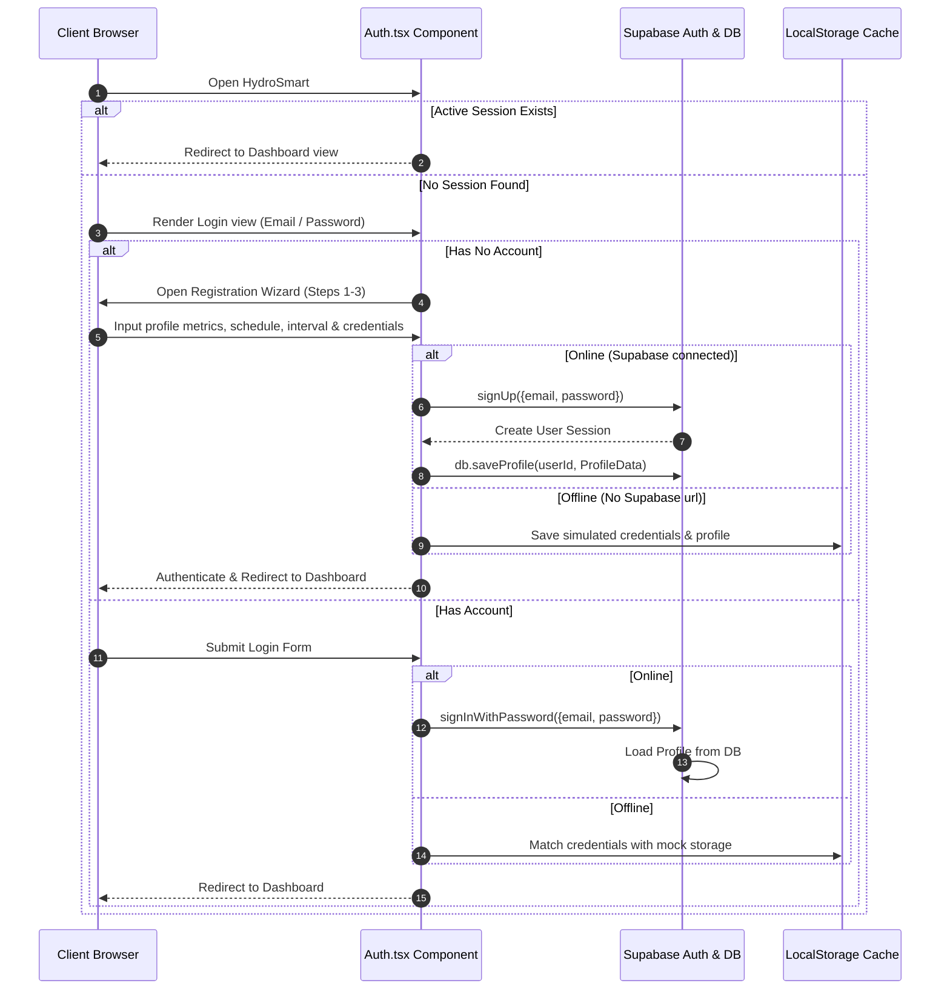
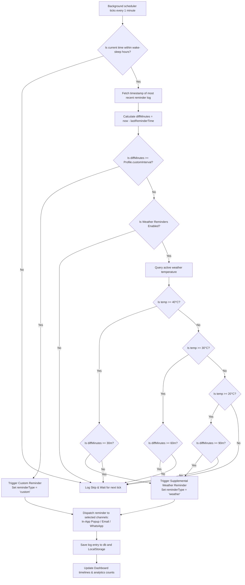
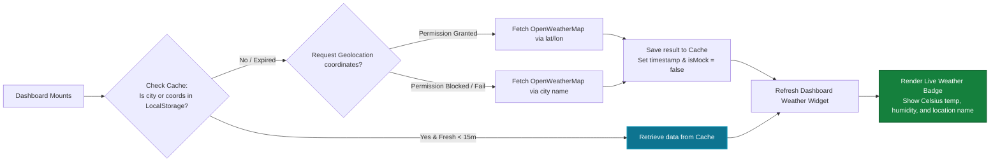

<p align="center">
  
</p>

<h1 align="center">💧 HydroSmart — Intelligent SaaS Hydration Reminder Platform</h1>

<p align="center">
  <strong>A production-ready SaaS platform designed for software engineers, students, and working professionals. Solves the challenge of desk-bound dehydration through mandatory custom base reminders, climate-adaptive supplemental alerts, geolocation-based weather tracking, and responsive visual analytics.</strong>
</p>

<p align="center">
  
  
  
  
  
  
  
  
</p>

---

## 📋 Table of Contents

- [🌟 Project Overview](#-project-overview)
- [🛠️ SaaS Tech Stack](#%EF%B8%8F-saas-tech-stack)
- [🏗️ Code Structure & Folder Organization](#-code-structure--folder-organization)
- [🔄 System & Execution Diagrams](#-system--execution-diagrams)
  - [1. User Session & Onboarding Sequence](#1-user-session--onboarding-sequence)
  - [2. Weather-Adaptive Reminder Supplemental Rules](#2-weather-adaptive-reminder-supplemental-rules)
  - [3. Geolocation & Weather Data Flow](#3-geolocation--weather-data-flow)
- [🚀 Setup & Installation](#-setup--installation)
  - [1. Clone & Install Dependencies](#1-clone--install-dependencies)
  - [2. Supabase Cloud Configuration](#2-supabase-cloud-configuration)
  - [3. Environment Credentials Setup](#3-environment-credentials-setup)
  - [4. Execution Commands](#4-execution-commands)
- [📖 SaaS Functional Breakdown](#-saas-functional-breakdown)
  - [Multi-Step Onboarding](#multi-step-onboarding)
  - [SaaS Header & Navigation Layout](#saas-header--navigation-layout)
  - [Hydration Tracking & PWA Installation](#hydration-tracking--pwa-installation)
  - [Visual Reminder & Hydration Analytics](#visual-reminder--hydration-analytics)
- [🏆 Gamification & Milestone Badges](#-gamification--milestones)

---

## 🌟 Project Overview

Desk-bound professionals, remote software engineers, and students frequently experience **inadvertent dehydration** due to long hours of focused screen time. **HydroSmart** addresses this problem by moving beyond simple volumetric tracking apps and establishing an **intelligent reminder engine** that runs proactively.

### Key Capabilities:
* **Proactive Reminders first**: The platform prioritizes notifications over manual logging. If the user chooses not to log water, the reminder system remains fully functional.
* **Mandatory Custom Intervals**: User-selected intervals (e.g., every 30m, 1h, 2h) are enforced during wake hours.
* **Weather-Adaptive Supplemental Alerts**: Integrates OpenWeatherMap to calculate temperature indices. Spikes in local heat trigger supplemental hydration alerts (every 30m above 40°C, every 60m above 30°C) without shifting the main custom reminder schedule.
* **Geolocation-Based Climate Detection**: Resolves city coordinates in real-time via browser geolocation APIs, backed by a **15-minute localStorage cache** to minimize weather API query fatigue.
* **Integrated Delivery Channels**: Connects In-App notifications, Email alerts (automatically using credentials without duplicate prompts), and WhatsApp messages (validated for 10-digit Indian mobile formats).
* **Responsive SaaS Grid**: A beautiful theme-toggleable full-screen layout built with Tailwind CSS, supporting side-by-side analytics visualizers, scheduler states, and historical timeline logs.

---

## 🛠️ SaaS Tech Stack

| Component | Technology | Description |
| :--- | :--- | :--- |
| **Frontend Framework** | React 18.3 & TypeScript 5.8 | Type-safe state managers, routing contexts, and rendering engines. |
| **Theme & Utility CSS**| Tailwind CSS 3.4 + CSS Variables | Design system with glassmorphism overlays and Dark/Light transitions. |
| **Database & Auth** | Supabase PostgreSQL & Auth | Remote session controls, profiles table, and logs sync. |
| **Build & Dev Server** | Vite 5.4 | Production asset bundling, HMR, and tree-shaking compilation. |
| **Visual Animation** | Framer Motion 12 | Spring-based physical animations for dialogs and modals. |
| **Analytics Visuals** | Recharts 2.15 | Responsive SVG renderers mapping logs and hourly reminders. |
| **Unit Test Suites** | Vitest 3.2 + JSDOM | Execution checks for streaks, weather formulas, and timezones. |
| **Weather Interface** | OpenWeatherMap REST API | Fetching real-time temperature, humidity, and weather conditions. |

---

## 🏗️ Code Structure & Folder Organization

```
hydrosmart/
├── .env.example                 # Environment template for weather API & Supabase
├── README.md                    # SaaS project overview, setup, and diagrams
├── architecture.md              # Technical design, component charts, and tech decision logs
├── projectdocumentation.md      # Detailed database schema, modules, and testing guidelines
├── package.json                 # Core dependencies, scripts, and build targets
├── tailwind.config.ts           # Design tokens, layouts, and theme configs
├── tsconfig.json                # TypeScript compilation guidelines
├── vite.config.ts               # Path aliases, dev-server ports, and bundler setups
├── index.html                   # HTML entry point with meta tags & SEO configs
│
├── public/                      # Static assets served directly
│   ├── favicon.ico              # Browser header bookmark icon
│   ├── logo.svg                 # Vector app logo
│   └── robots.txt               # Crawler instructions
│
└── src/                         # Application source files
    ├── main.tsx                 # Client entry point
    ├── App.tsx                  # Layout boundary, query provider, and page routing
    ├── index.css                # Tailwind directives and custom theme transition classes
    │
    ├── components/              # React UI Components
    │   ├── ui/                  # Atom-level layout primitives
    │   │   ├── button.tsx       # Standard interactive button component
    │   │   ├── input.tsx        # Styled form input field
    │   │   └── label.tsx        # Accessible form label component
    │   ├── Auth.tsx             # Auth gateway (Login / Wizard registration)
    │   ├── BadgeUnlockToast.tsx # Milestone achievement notifications
    │   ├── Dashboard.tsx        # Grid dashboard, top nav tabs, analytics visualizers
    │   ├── ErrorBoundary.tsx    # Exception catcher recovering from runtime crashes
    │   ├── GamificationPanel.tsx# Streak evaluation cards and badge matrices
    │   ├── ProfileSetup.tsx     # Full page / Modal profile setup editor
    │   ├── QuickAdd.tsx         # Quick water logging selectors
    │   ├── WaterProgress.tsx    # Circular intake progress circle
    │   └── WeatherCard.tsx      # Climate stats card and simulator panel
    │
    ├── lib/                     # Core Business Modules
    │   ├── gamification.ts      # Streaking algorithm and badge definition engine
    │   ├── hydration.ts         # Math engine calculating daily goal and timezone limits
    │   ├── notifications.ts     # 1-minute interval adaptive scheduler checks
    │   ├── supabase.ts          # Supabase client wrapper with transparent local fallbacks
    │   ├── utils.ts             # Tailwind class merges and local date utilities
    │   └── weather.ts           # OpenWeather client with caching (TTL 15m) & coords lookup
    │
    └── test/                    # Isolated Unit Verification Tests
        ├── setup.ts             # Test environment configurations
        ├── gamification.test.ts # Tests evaluating streak triggers and achievements
        └── hydration.test.ts    # Tests checking goals, intervals, and active hours
```

---

## 🔄 System & Execution Diagrams

### 1. User Session & Onboarding Sequence

This flowchart describes how a user is authenticated (online with Supabase or offline using mock storage) and onboarded with their complete health metrics.



---

### 2. Weather-Adaptive Reminder Supplemental Rules

This diagram maps the background scheduler logic executing every 60 seconds to evaluate scheduled vs adaptive reminders during active hours.



---

### 3. Geolocation & Weather Data Flow

This chart explains the coordinate retrieval process, local caching rules, and UI status mapping.



---

## 🚀 Setup & Installation

### 1. Clone & Install Dependencies
Make sure you have Node.js (v18+) and npm installed.

```bash
# Clone repository
git clone https://github.com/ramalokeshreddyp/hydrosmart-ai.git
cd hydrosmart-ai/aqua-smart-main

# Install packages
npm install
```

### 2. Supabase Cloud Configuration
Create a project on [Supabase](https://supabase.com/). In the SQL Editor, execute the database schema definitions inside `supabase/migrations/` to initialize tables:
- `public.profiles`
- `public.intake_logs`
- `public.reminder_logs` (Ensure the `reminder_type` column is created or run the migration).

### 3. Environment Credentials Setup
Create a `.env` file in the project root:
```bash
cp .env.example .env
```
Open `.env` and configure your API credentials:
```env
# Supabase Cloud variables
VITE_SUPABASE_URL=https://your-supabase-project-id.supabase.co
VITE_SUPABASE_ANON_KEY=eyJhbGciOiJIUzI1NiIsInR5cCI6IkpXVCJ9...

# OpenWeatherMap API Key (Verify weather accuracy)
VITE_WEATHER_API_KEY=fa1a86bf8d3d3f0c3a097ec917840d69
```

> [!NOTE]
> Leaving Supabase variables blank will run the app in **Offline mode** utilizing local mock storage.

### 4. Execution Commands

```bash
# Start local development server (http://localhost:5173)
npm run dev

# Run Vitest test runners
npm run test

# Run build compiling for production (outputs to dist/)
npm run build
```

---

## 📖 SaaS Functional Breakdown

### Multi-Step Onboarding
The onboarding/registration form is structured in a 3-step wizard to prevent layout clutter:
1. **Core Metrics**: Personal health statistics (weight baseline determines hydration metrics, city name or automatic browser geolocation determines weather lookup). A "Detect" location button is provided to automatically extract the user's city from their browser coordinates.
2. **Scheduling & Alert Interval**: Standard wake-up, sleep, and work hours. Set custom base reminder interval (mandatory), toggle weather adaptive alerts, and enter a mandatory daily water goal (must be at least 500 ml).
3. **Delivery Channels**: Checkboxes for In-App browser popups, Email (tied to account, no double field), and WhatsApp (validates Indian mobile numbers). Register email/password to finish.

### SaaS Header & Navigation Layout
The redesigned header replaces mobile modals with a desktop top-navigation bar:
- **Nav Tabs**: Inline toggle between **Dashboard** and **Settings** tab views.
- **Connection Status**: Renders current temperature, weather emoji, city coordinates, and a sync indicator (Green for Live API sync, Orange for Mock Simulation).
- **Theme Toggle**: Icon switches between Light and Dark modes. Colors adapt with a transition class, making changes feel smooth.

### Hydration Tracking & PWA Installation
- **Mandatory Goal**: Daily water intake tracking is mandatory. The dashboard features a clean, card-based responsive layout displaying the water progress ring, quick-log buttons, and history charts.
- **Progressive Web App (PWA)**: HydroSmart is fully configured as an installable Progressive Web App. When opening the website in a compatible browser:
  - An inline banner prompt appears: **Install HydroSmart Web App** with a **Download App** button.
  - A quick shortcut button **Install App** is rendered directly in the header next to the theme toggle.
  - Caching is managed locally by a service worker (`sw.js`) to support standalone mobile and desktop launching.

### Visual Reminder & Hydration Analytics
- **Dispatch Outbox**: A table at the right displays the history of dispatched alerts (date, time, type: custom vs weather, and channel outcome).
- **Analytics Visuals**: Includes Recharts charts representing daily custom vs weather reminder volumes, hourly reminder density patterns, and weekly intake history compared to goals.

---

## 🏆 Gamification & Milestones

Unlocking milestone achievement badges is dynamically checked upon log entry:
- 🥉 **Bronze**: *First Sip*, *Halfway (50% goal)*, *Consistent (3-day streak)*, *Week One*, *10L Total*.
- 🥈 **Silver**: *Goal Crusher (100% goal)*, *On Fire (7-day streak)*, *50L Total*, *Monthly (30-day consistency)*.
- 🥇 **Gold**: *Overachiever (150% goal)*, *10 Goals*, *Unstoppable (14-day streak)*, *Ocean (100L)*.
- 💎 **Diamond**: *Legend (30-day streak)*.

---

<p align="center">
  Optimizing workspace health, focus, and hydration.
</p>
