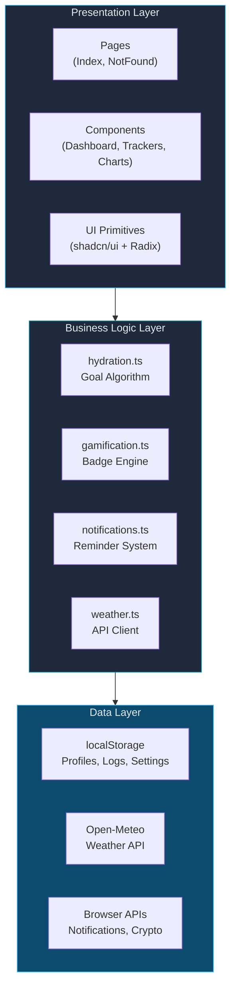
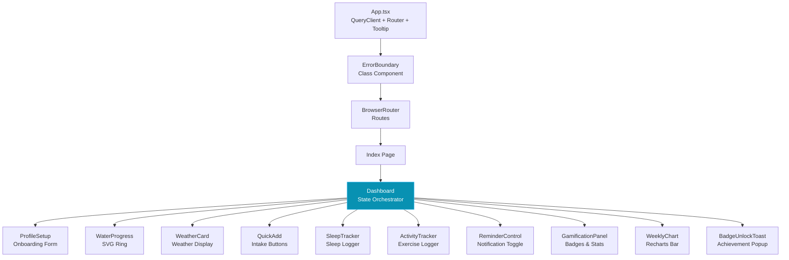
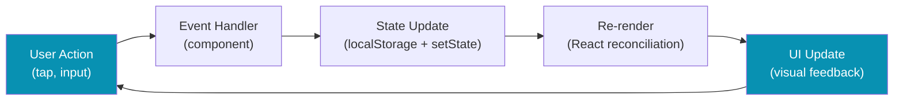
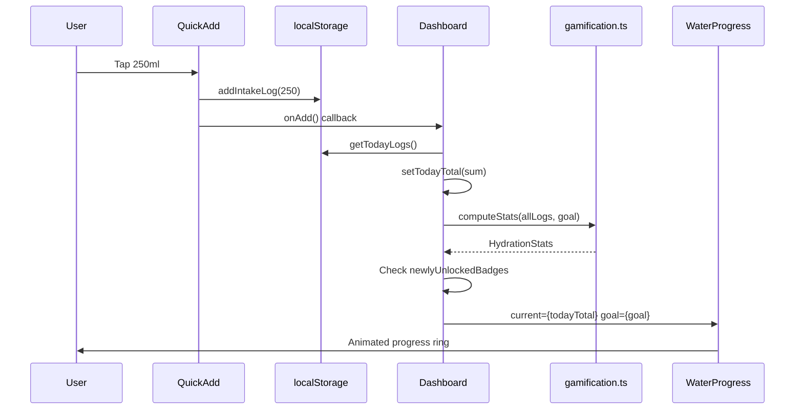
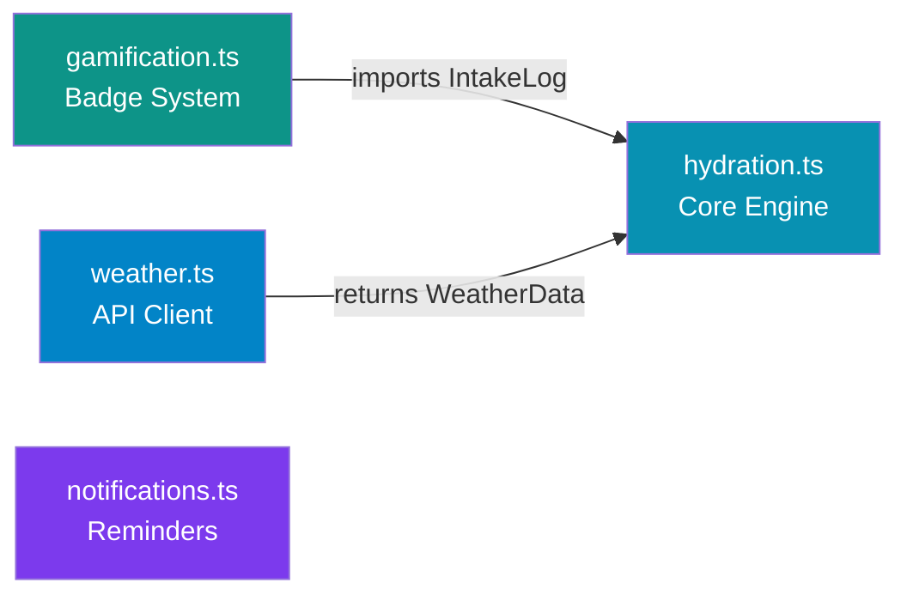
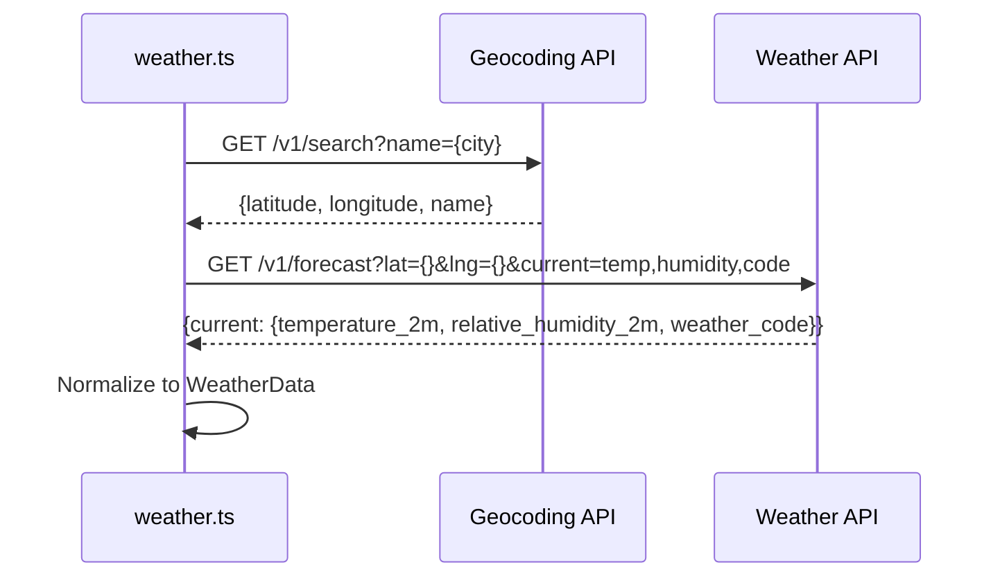
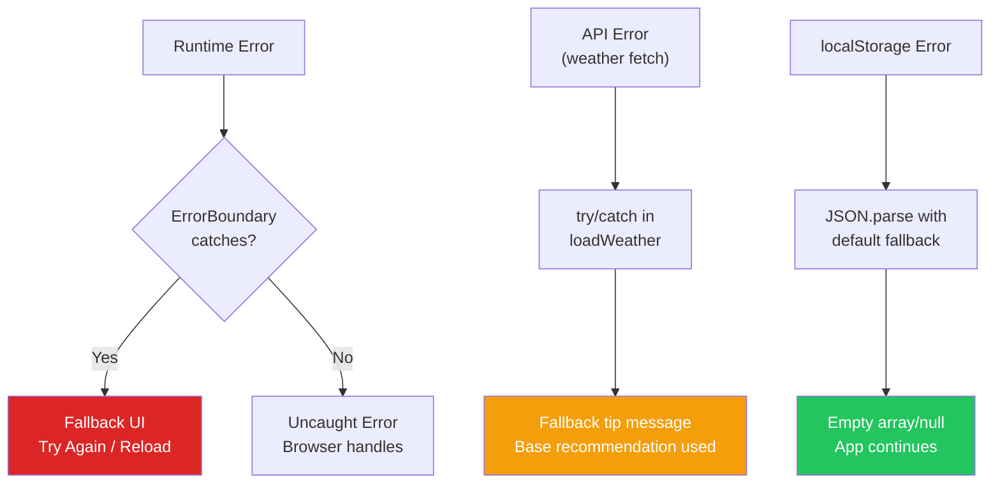

# 🏗️ HydroSmart — System Architecture

## Table of Contents

- [1. System Overview](#1-system-overview)
- [2. Architecture Principles](#2-architecture-principles)
- [3. High-Level Architecture](#3-high-level-architecture)
- [4. Component Architecture](#4-component-architecture)
- [5. Data Flow Architecture](#5-data-flow-architecture)
- [6. State Management](#6-state-management)
- [7. Business Logic Layer](#7-business-logic-layer)
- [8. External Integrations](#8-external-integrations)
- [9. UI Architecture & Design System](#9-ui-architecture--design-system)
- [10. Error Handling Architecture](#10-error-handling-architecture)
- [11. Performance Architecture](#11-performance-architecture)
- [12. Security Considerations](#12-security-considerations)
- [13. Scalability & Future Architecture](#13-scalability--future-architecture)

---

## 1. System Overview

HydroSmart is a **client-side single-page application (SPA)** built with React 18 and TypeScript. It implements a weather-adaptive hydration tracking system that dynamically computes personalized water intake goals using a multi-factor algorithm.

### Design Philosophy

```
┌────────────────────────────────────────────────────┐
│                  DESIGN PRINCIPLES                 │
├────────────────────────────────────────────────────┤
│  🎯 Single Responsibility — each module owns one   │
│     concern (weather, hydration, gamification)     │
│  📦 Colocation — components live near their logic  │
│  🔌 Loose Coupling — modules communicate through   │
│     well-defined interfaces                        │
│  🧱 Composition — complex UI from simple pieces    │
│  📱 Mobile-First — designed for touch, scales up   │
│  ♿ Accessible — ARIA labels, keyboard support      │
└────────────────────────────────────────────────────┘
```

---

## 2. Architecture Principles

| Principle | Application |
|-----------|-------------|
| **Separation of Concerns** | Business logic (`/lib`) is fully decoupled from UI (`/components`) |
| **Type Safety** | All data structures use TypeScript interfaces; no `any` types |
| **Pure Functions** | Core algorithms (`calculateDailyGoal`, `computeStats`) are pure and testable |
| **Graceful Degradation** | App works without weather API; falls back to base recommendations |
| **Progressive Enhancement** | Notifications are optional; core tracking works without them |
| **Responsive by Default** | All components use Tailwind breakpoints, safe-area insets |

---

## 3. High-Level Architecture



### Layer Responsibilities

| Layer | Files | Responsibility |
|-------|-------|---------------|
| **Presentation** | `components/`, `pages/` | Rendering, user interaction, animation |
| **Business Logic** | `lib/` | Algorithms, data transformation, API calls |
| **Data** | localStorage, Open-Meteo | Persistence, external data sources |

---

## 4. Component Architecture

### Component Hierarchy



### Component Classification

| Type | Components | Pattern |
|------|-----------|---------|
| **Container** | Dashboard | Owns state, orchestrates data flow |
| **Feature** | SleepTracker, ActivityTracker, QuickAdd, GamificationPanel | Self-contained features with local state + callbacks |
| **Display** | WaterProgress, WeatherCard, WeeklyChart | Pure presentation, receive data via props |
| **Utility** | ErrorBoundary, BadgeUnlockToast, ReminderControl | Cross-cutting concerns |
| **Form** | ProfileSetup | Controlled form with validation |

### Dashboard — The Orchestrator

Dashboard is the **central state coordinator**. It:

1. Loads profile from localStorage on mount
2. Fetches weather data for the user's city
3. Gathers sleep and activity logs for today
4. Computes the dynamic daily goal
5. Tracks intake and checks for new badge unlocks
6. Passes computed values down to child components

```
Dashboard State:
├── profile: UserProfile | null      ← localStorage
├── weather: WeatherData | null      ← Open-Meteo API
├── todayTotal: number               ← derived from logs
├── todaySleep: SleepLog | null      ← localStorage
├── todayActivities: ActivityLog[]   ← localStorage
├── stats: HydrationStats | null     ← computed from all logs
├── newBadge: Badge | null           ← delta from previous stats
├── tip: string                      ← weather-dependent message
└── goal: number                     ← calculateDailyGoal(...)
```

---

## 5. Data Flow Architecture

### Unidirectional Data Flow



### Data Flow for Water Intake



### Cross-Component Communication

```
ProfileSetup ──(onComplete)──→ Dashboard ──(re-mount)──→ All Children
SleepTracker ──(onUpdate)────→ Dashboard ──(recalc goal)→ WaterProgress
ActivityTracker ──(onUpdate)─→ Dashboard ──(recalc goal)→ WaterProgress
QuickAdd ──(onAdd)───────────→ Dashboard ──(refresh)────→ GamificationPanel
```

---

## 6. State Management

### State Architecture

HydroSmart uses a **lightweight state strategy** — no Redux or Zustand. State is managed at three levels:

| Level | Mechanism | Data |
|-------|-----------|------|
| **Component** | `useState` | Form inputs, UI toggles, expanded/collapsed |
| **Container** | `useState` + `useCallback` | Aggregated data, computed values |
| **Persistent** | `localStorage` | Profiles, logs, settings |
| **Server** | React Query | Weather API cache |

### localStorage Schema

```
hydration_profile       → UserProfile (JSON)
hydration_logs          → IntakeLog[] (JSON array)
hydration_sleep_logs    → SleepLog[] (JSON array)
hydration_activity_logs → ActivityLog[] (JSON array)
hydration_notifications_enabled → "true" | "false"
```

### Why No Global State Library?

- The app has a **single container** (Dashboard) that owns all shared state
- No deeply nested prop drilling — max 2 levels deep
- All cross-component communication goes through Dashboard callbacks
- localStorage serves as the "source of truth" for persistence

---

## 7. Business Logic Layer

### Module Dependency Graph



### hydration.ts — Core Algorithm

**Purpose**: Computes personalized daily hydration goal and manages intake data.

**Key Functions**:

| Function | Input | Output | Purity |
|----------|-------|--------|--------|
| `calculateDailyGoal()` | Profile, Weather, Sleep, Activities | `number` (ml) | ✅ Pure |
| `getReminderInterval()` | Profile, goalMl | `number` (minutes) | ✅ Pure |
| `getTemperatureLevel()` | temp | `"cool"\|"warm"\|"hot"\|"extreme"` | ✅ Pure |
| `getHydrationTip()` | Weather | `string` | ❌ Random |
| `addIntakeLog()` | amount | IntakeLog | ❌ Side effect (localStorage) |
| `getTodayLogs()` | — | IntakeLog[] | ❌ Side effect (localStorage) |

### gamification.ts — Badge Engine

**Purpose**: Tracks streaks, milestones, and unlocks achievement badges.

**Badge Evaluation**: All 14 badges are defined as condition functions against `HydrationStats`. On each intake, `computeStats()` rebuilds the full stats object and `getNewlyUnlockedBadges()` diffs against the previous snapshot.

### weather.ts — API Client

**Purpose**: Fetches real-time weather data via Open-Meteo (free, no API key).

**Flow**: City name → Geocoding API → lat/lng → Weather API → normalized `WeatherData`

### notifications.ts — Reminder System

**Purpose**: Manages browser push notification permissions, scheduling, and delivery.

**Architecture**: Uses `setInterval` with configurable period. Notifications only fire when the document is hidden (tab backgrounded) and notifications are enabled.

---

## 8. External Integrations

### Open-Meteo Weather API



**Why Open-Meteo?**
- ✅ Free, no API key required
- ✅ No rate limiting for personal use
- ✅ Accurate global coverage
- ✅ Simple REST interface
- ✅ Returns weather codes → mapped to descriptions/icons

### Browser Notifications API

- Permission-based: requests `Notification.permission`
- Graceful fallback: feature-detected with `"Notification" in window`
- Uses `tag` property to prevent notification stacking

---

## 9. UI Architecture & Design System

### Design Token System

All colors use HSL values defined as CSS custom properties in `index.css`:

```
:root
├── --background: 195 30% 97%
├── --foreground: 200 50% 10%
├── --primary: 192 82% 45%        (Teal/Cyan — water theme)
├── --accent: 168 70% 42%          (Green — success states)
├── --water-light/medium/deep/glow (Water-specific palette)
├── --success / --warning / --hot  (Semantic status colors)
└── Dark mode overrides via .dark
```

### Responsive Breakpoint Strategy

```
Mobile-first approach:
├── Base (0px)     → Single column, compact spacing, touch-optimized
├── sm (640px)     → Slightly larger text, more padding
├── md (768px)     → Two-column layouts where applicable
└── lg (1024px)    → Max-width container, centered
```

### Animation Architecture

Framer Motion is used for:
- **Page transitions**: `initial → animate` on component mount
- **Staggered lists**: `delay` prop for sequential reveal
- **Expandable sections**: `AnimatePresence` for enter/exit
- **Progress animations**: Spring physics on the SVG ring

---

## 10. Error Handling Architecture



### Error Handling Layers

| Layer | Strategy | Recovery |
|-------|----------|----------|
| **React Render** | ErrorBoundary class component | Reset state or reload page |
| **API Calls** | try/catch in async functions | Fallback content, user message |
| **Data Parsing** | Default values in JSON.parse | Empty arrays, null defaults |
| **User Input** | Controlled inputs with validation | Prevent invalid submissions |

---

## 11. Performance Architecture

### Optimization Strategies

| Strategy | Implementation |
|----------|---------------|
| **Memoization** | `useCallback` for event handlers in Dashboard |
| **Lazy Loading** | Vite's automatic code splitting |
| **Minimal Re-renders** | Callbacks avoid passing new function refs |
| **Efficient DOM** | SVG-based progress ring (single element) |
| **Bundle Size** | Tree-shaking via ES modules, Vite minification |
| **Font Loading** | Google Fonts with `display=swap` |

### Build Output

Vite produces optimized chunks:
- Vendor chunk: React, React DOM, Radix primitives
- App chunk: Application code
- CSS: Single minified stylesheet with Tailwind purge

---

## 12. Security Considerations

| Concern | Mitigation |
|---------|-----------|
| **XSS** | React's default escaping; no `dangerouslySetInnerHTML` |
| **Data Privacy** | All data stored client-side in localStorage |
| **API Keys** | Open-Meteo requires no API key |
| **Input Validation** | Controlled inputs with type constraints |
| **HTTPS** | Enforced by deployment platform |

---

## 13. Scalability & Future Architecture

### Migration Path to Full-Stack


| Phase | Addition | Impact |
|-------|----------|--------|
| **Phase 1** | User authentication | Multi-device sync, account security |
| **Phase 2** | Database persistence | Replace localStorage, enable analytics |
| **Phase 3** | Server-side logic | AI recommendations, email reminders |
| **Phase 4** | PWA with service worker | Offline tracking, home screen install |

### Current Limitations

- **No cross-device sync**: localStorage is browser-local
- **No offline support**: Requires network for weather
- **No data export**: Logs cannot be exported
- **Single user**: No multi-profile support

These limitations are addressed in the scalability roadmap and can be implemented by integrating a backend database (e.g. Supabase, Firebase, or a custom REST API).
