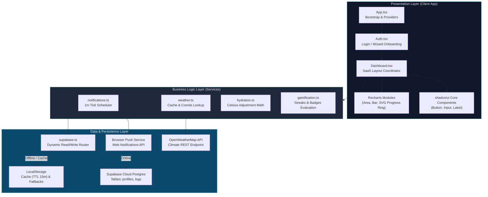
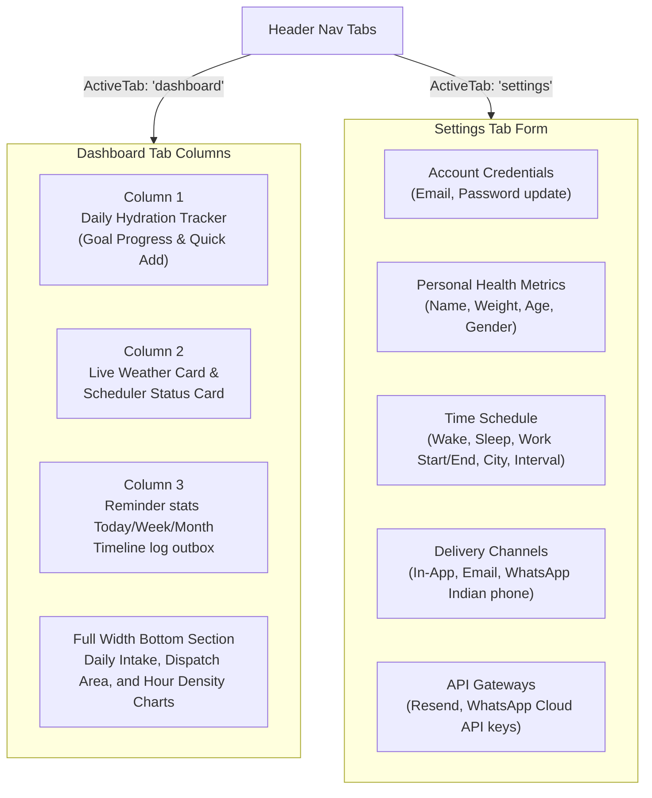
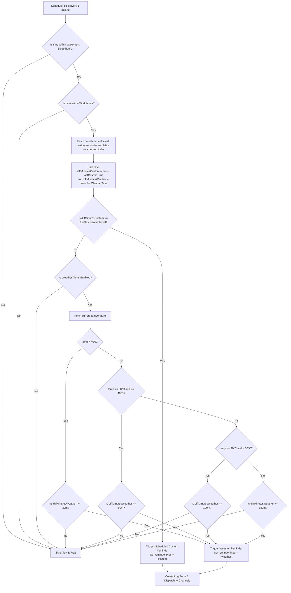
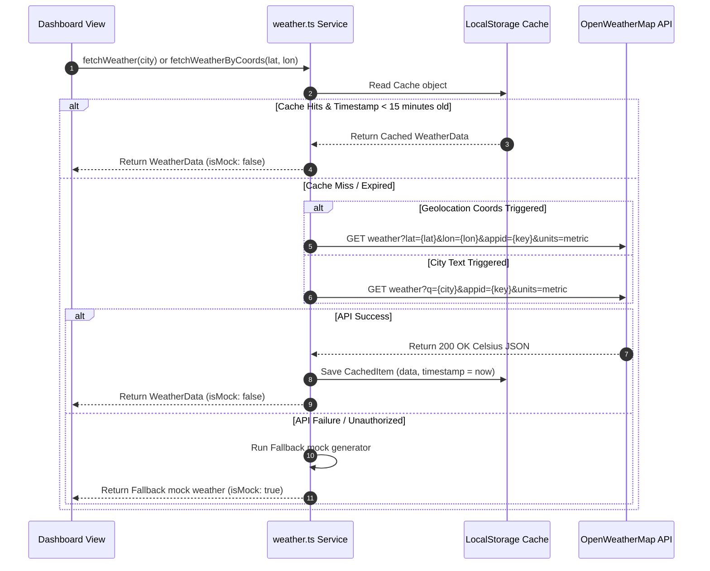

# 🏗️ HydroSmart — SaaS System Architecture Documentation

This document describes the SaaS system architecture, separation of concerns, component layers, weather caching strategy, dual-reminder schedule algorithms, and integration schemas of the **HydroSmart** platform.

---

## 📋 Table of Contents

- [1. System Design & SaaS Strategy](#1-system-design--saas-strategy)
- [2. High-Level Modular Architecture](#2-high-level-modular-architecture)
- [3. Tab Routing & Views Isolation](#3-tab-routing--views-isolation)
- [4. Dual-Reminder Dispatch Engine](#4-dual-reminder-dispatch-engine)
- [5. Geolocation Coordinates & Caching Layer](#5-geolocation-coordinates--caching-layer)
- [6. Visual Analytics Pipeline](#6-visual-analytics-pipeline)
- [7. Tech Stack Selection Rationale](#7-tech-stack-selection-rationale)
- [8. System Pros, Cons, and Mitigations](#8-system-pros-cons-and-mitigations)
- [9. Security Model & Database Schema](#9-security-model--database-schema)
- [10. Error Handling & Fault Boundaries](#10-error-handling--fault-boundaries)

---

## 1. System Design & SaaS Strategy

HydroSmart is built as an **Offline-First, Cloud-Synchronized SaaS Single Page Application (SPA)**. It prioritizes **proactive health reminders** over simple volumetric recording.

### Core Architectural Principles:
* **Reminders First, Tracking Optional**: Hydration reminders execute independently of whether a user logs their water intake.
* **Separation of Concerns**: Strictly separates UI layouts (`/components`), helper services (`/lib`), route containers (`/pages`), and schema migrations (`/supabase/migrations`).
* **Offline Fallback Adapter**: Decoupled database helper (`db`) dynamically switches between Supabase cloud queries and local storage depending on credential availability, ensuring zero application crashes.
* **Accurate Meteorological Alignment**: Integrates live temperature queries and caching to adapt reminder frequencies to actual local weather.

---

## 2. High-Level Modular Architecture

The application is structured in three logical layers:



---

## 3. Tab Routing & Views Isolation

The top navigation bar acts as the master routing panel, toggling the dashboard view state.



---

## 4. Dual-Reminder Dispatch Engine

The reminder scheduler uses two concurrent alert models:
1. **Mandatory Custom reminders**: Set by the user (e.g. every 11m, 30m). These execute during wake hours and preferably work hours.
2. **Supplemental Weather reminders**: Checked against outdoor temperatures. Spikes or drops in local heat trigger supplemental breaks at strict intervals (30m, 1h, 2h, or 3h), decoupled from custom reminders.

### Background Check Flow (1-Minute Interval):



---

## 5. Geolocation Coordinates & Caching Layer

To verify weather accuracy and avoid hitting OpenWeatherMap API limits, a 15-minute Time-To-Live (TTL) cache is implemented inside `localStorage`.

### Data Retrieval & Resolution Workflow:



---

## 6. Visual Analytics Pipeline

HydroSmart records every reminder log to compute analytics:
- **Daily Custom vs Weather Counts**: Reminder logs are parsed daily to build Area charts showing scheduled reminders versus supplemental alerts.
- **Hourly Reminder Density**: Maps log timestamps into a 24-hour array to draw a bar chart representing the times of day reminders are most frequently sent.
- **Weekly Intake History**: Compares intake amounts to daily goals (if goal tracking is enabled).

---

## 7. Tech Stack Selection Rationale

- **React & TypeScript**: Chosen for standard SPA routing, clean interface state bindings, and type-safety.
- **Tailwind CSS + CSS Variables**: Provides theme transitions (Dark/Light mode) without layout reflows.
- **Supabase (PostgreSQL & Go Auth)**: Offers scalable cloud account syncing and security policies without backend setup.
- **Recharts (SVG-based)**: Provides clean, responsive SVG analytics charts.
- **Vitest**: Supports fast, modern unit tests matching Vite configurations.

---

## 8. System Pros, Cons, and Mitigations

### Pros:
1. **Resilient Offline Fallback**: The app operates fully locally if the database is configured incorrectly or offline.
2. **Performance Optimized**: Built-in 15-minute weather caching limits network overhead and prevents rate-limiting issues.
3. **Dynamic Climate Tuning**: Targets adapt to weather changes in real-time.

### Cons & Mitigations:
- **API Key Limits**: Free OpenWeather API keys are limited.
  - *Mitigation*: The app uses a 15-minute cache and includes a simulated mock generator to keep the app functional if key errors occur.
- **Browser Push Limitations**: Browsers require user permission to show push alerts.
  - *Mitigation*: The app falls back to in-app dialog overlays if browser push permissions are denied.

---

## 9. Security Model & Database Schema

Every transaction is protected at the database level using Row Level Security (RLS) policies:

```sql
-- Profiles table structure
CREATE TABLE public.profiles (
  id UUID REFERENCES auth.users ON DELETE CASCADE PRIMARY KEY,
  name TEXT NOT NULL,
  weight NUMERIC NOT NULL,
  age INTEGER NOT NULL,
  gender TEXT NOT NULL DEFAULT 'other',
  city TEXT NOT NULL,
  wake_time TEXT NOT NULL DEFAULT '07:00',
  sleep_time TEXT NOT NULL DEFAULT '23:00',
  work_start TEXT NOT NULL DEFAULT '09:00',
  work_end TEXT NOT NULL DEFAULT '17:00',
  custom_interval INTEGER NOT NULL DEFAULT 60,
  weather_reminders_enabled BOOLEAN NOT NULL DEFAULT TRUE,
  channels TEXT[] NOT NULL DEFAULT ARRAY['in-app'],
  email TEXT,
  phone TEXT,
  manual_goal INTEGER,
  updated_at TIMESTAMP WITH TIME ZONE DEFAULT timezone('utc'::text, now())
);

-- Row Level Security Policy
ALTER TABLE public.profiles ENABLE ROW LEVEL SECURITY;
CREATE POLICY "Users manage profiles" ON public.profiles FOR ALL USING (auth.uid() = id);
```

---

## 10. Error Handling & Fault Boundaries

The UI is wrapped in a React `ErrorBoundary` class component. In addition, API fetch operations fall back to cached or deterministic mock data if network connections fail. This ensures that a failure in one module does not disrupt the rest of the application.

---

## 11. Progressive Web App (PWA) Architecture

HydroSmart is built to meet full browser PWA requirements, allowing users to install the website as a standalone application on mobile or desktop environments:
1. **Web App Manifest (`public/manifest.json`)**: Configures application naming, brand icons (`logo.svg` maskables), standalone display properties, and orientation parameters.
2. **Service Worker Lifecycle (`public/sw.js`)**:
   - *Install*: Caches core static shell assets (`/`, `index.html`, `logo.svg`, `favicon.ico`) to speed up loading.
   - *Activate*: Claims clients immediately via `clients.claim()` to start caching fetches.
   - *Fetch*: Implements a network-first, cache-fallback interception strategy to serve resources.
3. **Install Banner UI**: Captures browser-dispatched `beforeinstallprompt` events and exposes a custom install card on the Dashboard view alongside a header button, prompting users to install the application.
