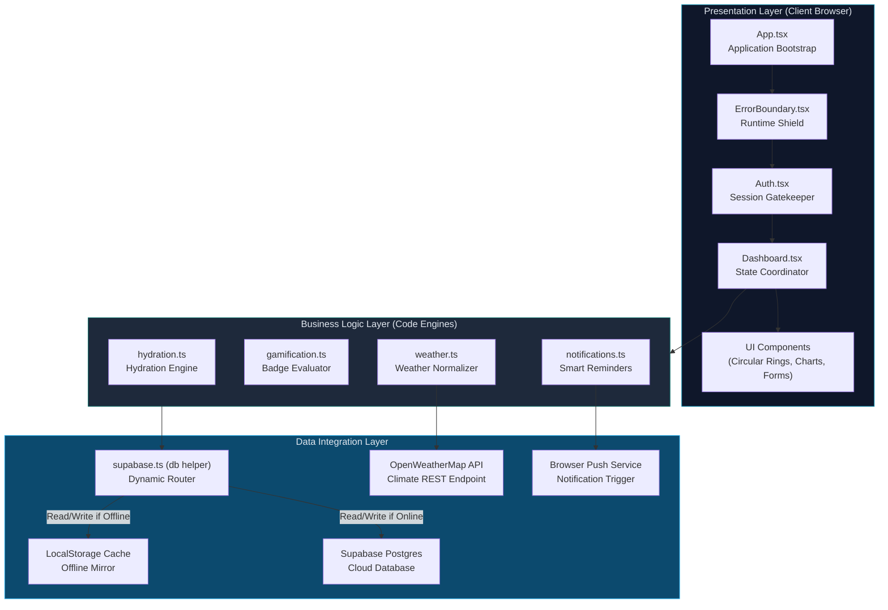
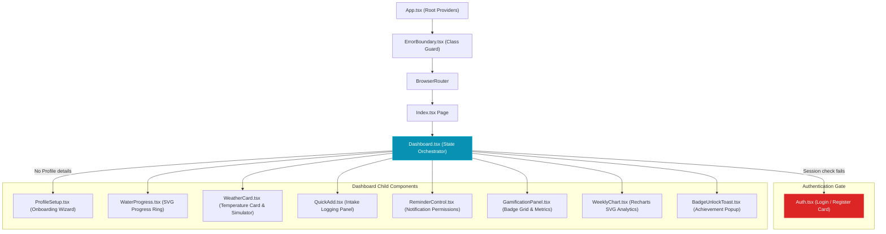
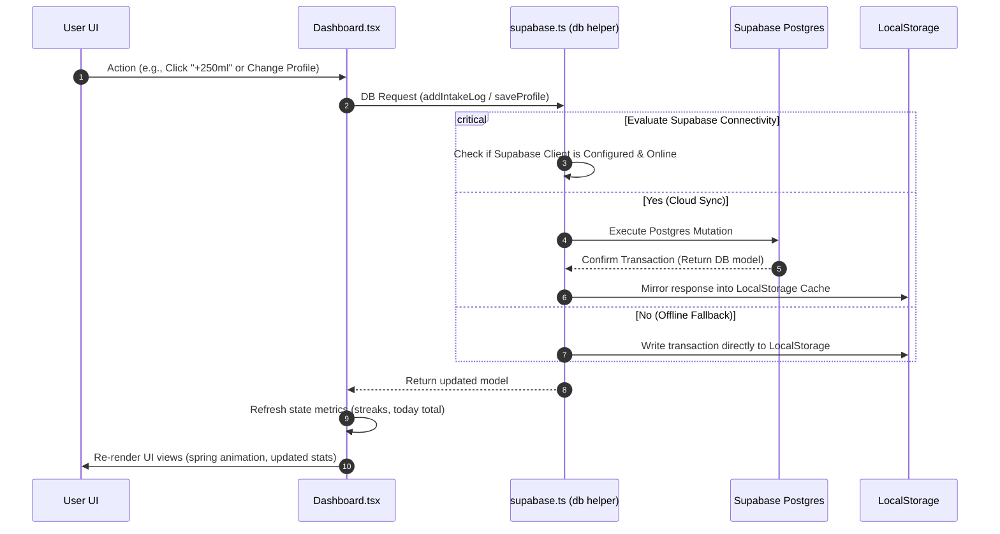
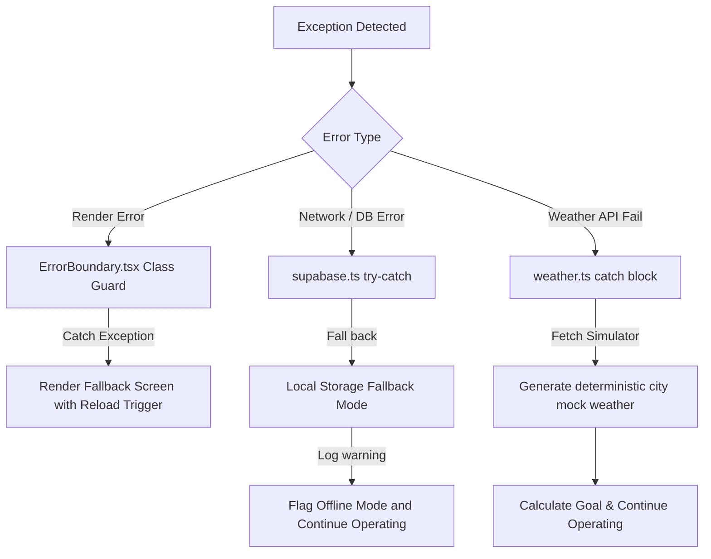

# 🏗️ HydroSmart — System Architecture Documentation

This document describes the architectural design, component layers, data pipelines, state strategies, and integration boundaries of **HydroSmart**.

---

## 📋 Table of Contents

- [1. System Design & Architectural Strategy](#1-system-design--architectural-strategy)
- [2. High-Level Architecture](#2-high-level-architecture)
- [3. Component Architecture & Hierarchy](#3-component-architecture--hierarchy)
- [4. Data Flow & Synchronization Layer](#4-data-flow--synchronization-layer)
- [5. State Management & Offline-First Strategy](#5-state-management--offline-first-strategy)
- [6. Core Math & Logical Engines](#6-core-math--logical-engines)
- [7. External Integrations](#7-external-integrations)
- [8. Security Model & Row Level Security (RLS)](#8-security-model--row-level-security-rls)
- [9. Error Handling & Fault Tolerance](#9-error-handling--fault-tolerance)
- [10. Design System & Typography Integration](#10-design-system--typography-integration)

---

## 1. System Design & Architectural Strategy

HydroSmart is built as a hybrid **Client-Server Single Page Application (SPA)** that prioritizes **resilient availability**. The application is structured to decouple views from core math engines and abstract data management through an adapter pattern that switches between cloud database schemas and browser storage.

### Core Architectural Principles:
* **Separation of Concerns**: UI rendering (`/components`) is strictly isolated from calculations and API parsing (`/lib`).
* **Graceful Degradation**: Features fall back to reasonable defaults if external dependencies (such as weather servers or databases) become unavailable.
* **Pure Logical Engines**: Core math operations like goal sizing and streak calculations are structured as pure functions to simplify unit testing.
* **Resilient Data Access**: DB client wrapper (`db`) operates transparently, caching transactions locally so stats remain warm and responsive.

---

## 2. High-Level Architecture

The system is organized into three distinct layers: Presentation, Business Logic, and the Data Integration Layer.



---

## 3. Component Architecture & Hierarchy

The visual shell uses an orchestrator container pattern where one controller component manages asynchronous loops, session subscriptions, and passes down state.



### Component Categories:
1. **Container Orchestrator**: `Dashboard.tsx` listens to auth state changes, polls OpenWeatherMap, updates goals, aggregates intake logs, and dispatches data.
2. **Interactive Handlers**: `QuickAdd.tsx`, `ProfileSetup.tsx`, and `Auth.tsx` validate form inputs and trigger database updates.
3. **Data Visualizers**: `WaterProgress.tsx` uses custom SVG paths and spring parameters. `WeeklyChart.tsx` maps daily arrays using Recharts components.
4. **Toast Alerts**: `BadgeUnlockToast.tsx` is mounted within `AnimatePresence` for dynamic entrance and exit animations.

---

## 4. Data Flow & Synchronization Layer

HydroSmart utilizes **unidirectional data flows** to keep the application view in sync with storage layers.



---

## 5. State Management & Offline-First Strategy

The application avoids complex state libraries like Redux or Zustand. State is managed using React hooks colocated at the container level, utilizing an **offline-first local mirror pattern**.

| Layer | Implementation | Purpose / Managed Scope |
| :--- | :--- | :--- |
| **Volatile Client State** | `useState`, `useRef`, `useCallback` | Track active user session, loading masks, open modals, simulated weather states, and previous badge benchmarks. |
| **Server Cache State** | React Query | Cache API calls to OpenWeatherMap, preventing unnecessary network queries. |
| **Data Gateway** | `supabase.ts` | Abstract database operations and route data based on config flags. |
| **Persistence Mirror** | `localStorage` | Backs up profiles, logs, and reminder data locally to ensure instant page loads and offline usability. |

---

## 6. Core Math & Logical Engines

The application's logic resides in `src/lib/` as type-safe TypeScript modules.

### A. Hydration Goal Calculation (`src/lib/hydration.ts`)
Calculates the dynamic goal according to weight and real-time weather details:
$$\text{Baseline} = \max(\text{weight} \times 35\,\text{ml}, 2500\,\text{ml})$$
* **Temperature Adjustment**: Adds $25\,\text{ml}$ per degree above $25^\circ\text{C}$ up to $30^\circ\text{C}$, and $50\,\text{ml}$ per degree above $30^\circ\text{C}$.
* **Humidity Adjustment**: Adds $300\,\text{ml}$ if relative humidity is below $30\%$, and $150\,\text{ml}$ if below $50\%$.
* **Manual Override**: If `manualGoal` is configured in the profile, it overrides all other calculations.
* **Rounding**: The final target is rounded to the nearest $50\,\text{ml}$ for clean tracking.

### B. Smart Reminder Intervals
Determines the spacing between notifications based on current temperature:
* Temp $< 20^\circ\text{C} \implies 120$ minutes (2-hour reminder)
* Temp $20^\circ\text{C} \le \text{temp} \le 30^\circ\text{C} \implies 90$ minutes (1.5-hour reminder)
* Temp $30^\circ\text{C} < \text{temp} \le 40^\circ\text{C} \implies 60$ minutes (1-hour reminder)
* Temp $> 40^\circ\text{C} \implies 30$ minutes (30-minute reminder)

### C. Streak & Achievement Logic (`src/lib/gamification.ts`)
* **Consecutive Streaks**: Evaluates daily intake against target goals. If today has no logs yet, the streak count check is evaluated starting from yesterday to prevent resetting streaks prematurely.
* **Consistency Score**: Evaluates tracking behavior over a rolling 7-day window.

---

## 7. External Integrations

### 1. OpenWeatherMap API
Fetches local weather conditions by city name.
* **Flow**: Request city name $\implies$ API returns JSON details $\implies$ Normalization maps weather codes to descriptive emojis (`☀️`, `⛅`, `🌧️`, `⛈️`, `❄️`, `🌫️`).
* **Fallback**: Uses a deterministic mock generator in `src/lib/weather.ts` if the request fails, matching temperature and humidity profiles to regional characteristics.

### 2. Browser Notifications API
Triggers system push notifications during waking hours.
* Requests permission explicitly via `Notification.requestPermission()`.
* Schedules reminders based on the computed interval using `setInterval`.
* Only fires when the browser window is backgrounded (`document.hidden === true`) to prevent spamming active users.
* Uses the `tag: "hydration-reminder"` attribute to replace outdated notifications on screen.

---

## 8. Security Model & Row Level Security (RLS)

Integrating Supabase shifts data security to the database level. Each table in the PostgreSQL database is configured with **Row Level Security (RLS)** to isolate user data.

```sql
-- Enable Row Level Security
ALTER TABLE public.profiles ENABLE ROW LEVEL SECURITY;
ALTER TABLE public.intake_logs ENABLE ROW LEVEL SECURITY;
ALTER TABLE public.reminder_logs ENABLE ROW LEVEL SECURITY;

-- Security Policies
CREATE POLICY "Users can manage their own profiles"
  ON public.profiles FOR ALL USING (auth.uid() = id);

CREATE POLICY "Users can manage their own intake logs"
  ON public.intake_logs FOR ALL USING (auth.uid() = user_id);

CREATE POLICY "Users can manage their own reminder logs"
  ON public.reminder_logs FOR ALL USING (auth.uid() = user_id);
```

Under these policies:
* Users can only read and write data that matches their authenticated `auth.uid()`.
* Direct access bypasses are blocked, ensuring secure data isolation.

---

## 9. Error Handling & Fault Tolerance

HydroSmart uses layered error boundaries to prevent runtime exceptions from crashing the app:



* **Storage Fallbacks**: Any database query caught in a `try/catch` block automatically redirects to local storage arrays to keep the app operational.
* **Input Boundaries**: Controlled inputs validate form data before it is sent to database modules.

---

## 10. Design System & Typography Integration

The user interface uses a custom HSL design system configured in `src/index.css` and `tailwind.config.ts`.

### Theme Color Definitions:
* **Backgrounds**: Slate tones (`--background`: `195 30% 97%`, `--foreground`: `200 50% 10%`) for a clean, professional aesthetic.
* **Brand Primary**: Hydro Cyan (`--primary`: `192 82% 45%`) representing water.
* **Accent Success**: Emerald Green (`--accent`: `168 70% 42%`) for achievements and completion.
* **Glassmorphism Styling**: Backgrounds use `backdrop-blur-lg bg-white/40 border border-white/20 dark:bg-slate-900/40 dark:border-slate-800/20` to create a modern visual look.

### Typography Hierarchy:
* **Headings**: `Space Grotesk`, sans-serif (Weights: `600`, `700`) for structural elements.
* **Body & Data**: `Plus Jakarta Sans`, sans-serif (Weights: `400`, `500`, `700`) for readability.
