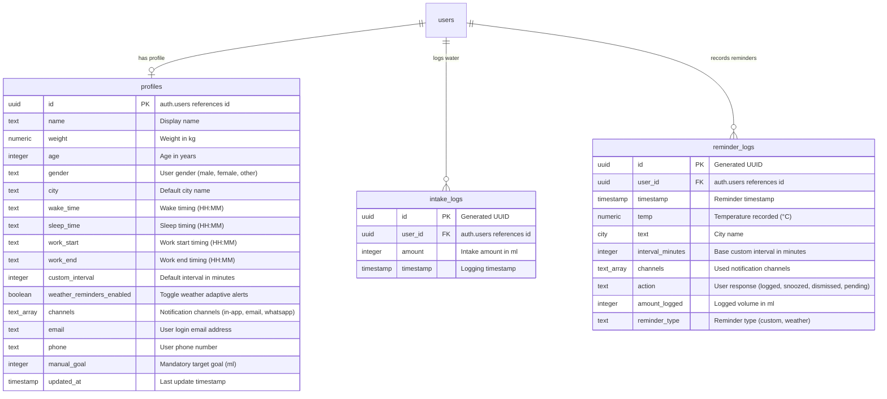

# 📖 HydroSmart — Complete Project Documentation

This documentation provides an in-depth guide to **HydroSmart**, a production-ready SaaS hydration reminder platform.

---

## 1. Project Concept & SaaS Objective

### The Problem
Software engineers, students, remote workers, and office professionals often work continuously for long hours without drinking water, taking physical breaks, or monitoring their health. Static reminders are easily ignored, and traditional water tracking apps require tedious manual logging, which users eventually abandon.

### The SaaS Solution
**HydroSmart** solves this by prioritizing **proactive reminders** over manual tracking. It calculates baseline water requirements and schedules mandatory reminders. Additionally, it adapts to local climates by checking weather conditions and triggering supplemental hydration alerts when temperatures spike.

### Primary Goals:
* **Proactive Reminders first**: Reminders are the core feature.
* **Mandatory Custom Intervals**: User-defined schedules (e.g. every 2 hours) always execute.
* **Supplemental Weather Alerts**: Supplemental notifications fire in between scheduled reminders during extreme weather conditions (e.g., above 30°C or 40°C), decoupled from custom reminders.
* **Indian Mobile Validation**: Integrates WhatsApp delivery options, enforcing valid 10-digit Indian formats (+91).
* **Comprehensive Analytics**: Displays reminder dispatch metrics (frequency per day and hourly density) alongside mandatory daily water intake history.

---

## 2. SaaS Module Breakdown

### A. Auth Gateway (`src/components/Auth.tsx`)
Coordinates user entry.
- **Login Landing**: Displays email and password forms on startup.
- **Registration Wizard**: Uses a 3-step setup form:
  - *Step 1*: Personal metrics (Name, Weight, Age, Gender, City with GPS auto-detect switch).
  - *Step 2*: Schedule configurations (Wake, Sleep, Work Start/End, Custom Interval, Weather Alerts check, and Mandatory Daily Goal of at least 500ml).
  - *Step 3*: Delivery channels (In-App, Email, WhatsApp with Indian mobile validation) and account credentials.
- **Offline Gateway**: Enables offline guest logins by matching credentials against local storage profiles.

### B. Responsive Grid Dashboard (`src/components/Dashboard.tsx`)
Serves as the main workspace container.
- **SaaS Header Nav**: Hosts view toggles (**Dashboard** vs **Settings**), live weather badges, dark/light theme toggles, and sign out button. Includes a PWA startup modal to suggest installing standalone apps.
- **Theme Manager**: Updates the document root node classes dynamically with CSS variable transitions.
- **Grid Layout**:
  - *Intake Tracker*: circular water progress ring (mandatory).
  - *Climate & Sync*: Live weather info (with auto-location coordinates detection), adaptive details, mute button, and preset buttons.
  - *Dispatched Feed*: Sent count metrics (today, week, month) and chronological outbox timeline.
- **Recharts Analytics**: Draws intake histories, daily reminder counts (custom vs weather trends), and hourly density distributions.

### C. Background Adaptive Scheduler (`src/lib/notifications.ts`)
Executes checks every 60 seconds.
- Checks if the user is inside their active work hours (`workStart` to `workEnd`).
- Computes time elapsed since the last scheduled custom reminder (`diffMinutesCustom`) and since the last weather reminder (`diffMinutesWeather`).
- Triggers a scheduled custom reminder if `diffMinutesCustom >= customInterval` (decoupled from weather alerts).
- Triggers supplemental weather reminders if `weatherRemindersEnabled` is active and `diffMinutesWeather` exceeds weather thresholds:
  - Temperature $\ge 40^\circ\text{C}$ and time since last weather reminder $\ge 30$ mins.
  - Temperature $\ge 30^\circ\text{C}$ and time since last weather reminder $\ge 60$ mins.
  - Temperature $< 30^\circ\text{C}$: no weather break alarms (it is "okay").

### D. Weather Cache & Geolocation Client (`src/lib/weather.ts`)
Fetches and caches weather conditions.
- Uses `navigator.geolocation` coordinates for precise weather lookup.
- Falls back to city name lookups if geolocation permissions are denied.
- Caches responses in `localStorage` with a **15-minute Time-To-Live (TTL)**.
- Includes a fallback mock simulator if the OpenWeatherMap API returns errors.

### E. Full Page Settings Editor (`src/components/Dashboard.tsx` Settings Tab)
Allows modifying profile details:
- Credentials (Email, Password update).
- Personal metrics (Name, Weight, Age, Gender, City with GPS auto-detect toggle).
- Schedule (Wake, Sleep, Work Start/End, Custom Interval, Weather switch, Mandatory Daily Goal).
- Channel options (In-App, Email, WhatsApp Indian phone).

---

## 3. Database Schema & Data Models

HydroSmart is backed by a PostgreSQL database integrated with Supabase. RLS policies isolate user data at the database level.



---

## 4. Technical Integration Details

### A. Geolocation coordinates fetch:
`fetchWeatherByCoords(lat, lon)` requests weather data from:
```
https://api.openweathermap.org/data/2.5/weather?lat=${lat}&lon=${lon}&appid=${API_KEY}&units=metric
```

### B. WhatsApp phone format verification:
A phone input is validated using:
```typescript
const validateIndianPhone = (num: string): boolean => {
  return /^(?:\+91|91)?[6-9]\d{9}$/.test(num.trim());
};
```

---

## 5. Testing & Quality Assurance

Automated unit tests in `/src/test` verify calculation logic and streaks using Vitest:

```bash
# Run tests
npm run test
```

### Main Test Scenarios:
1. **Hydration Engine Tests (`hydration.test.ts`)**:
   - Verify weight calculations.
   - Verify weather-based goal adjustments (+25ml above 25°C, +50ml above 30°C).
   - Verify low humidity goal adjustments.
2. **Gamification Engine Tests (`gamification.test.ts`)**:
   - Verify streak increments when daily targets are met.
   - Verify that empty logs do not break consistency calculations.
   - Verify badge unlocks.

---

## 6. Pros, Cons & Design Trade-offs

### Advantages
- **Mandatory Base Schedules**: Ensures users receive scheduled reminders regardless of weather conditions.
- **Supplemental Alerts**: Triggers extra alerts when temperatures spike.
- **Weather Caching**: Uses a 15-minute weather cache to prevent API rate-limiting issues.
- **Dark & Light Themes**: Responsive design theme toggles.
- **Mandatory Goal Tracking**: Daily hydration goals are mandatory, encouraging consistent tracking.
- **PWA Capabilities**: Installable as a standalone app with an app-prompt banner and header shortcut.

### Limitations
- **Browser Push Permission**: Desktop push notifications require browser permission.
- **Cache Clears**: Clearing browser caches removes simulated offline profiles.
- **Offline Sync**: Logs recorded offline do not automatically sync to the database when a connection is restored.
