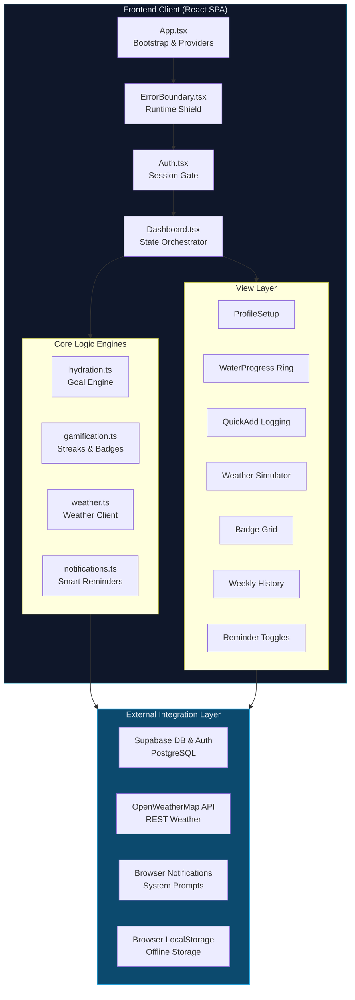
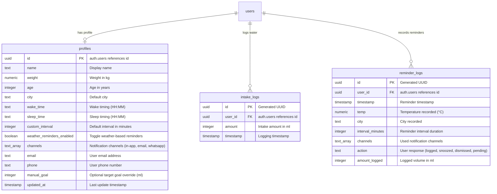
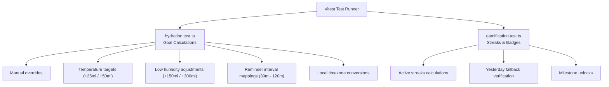

# 📖 HydroSmart — Complete Project Documentation

This documentation provides an in-depth guide to **HydroSmart**, a weather-adaptive hydration tracking application.

---

## 1. Project Overview

### Concept
**HydroSmart** is a smart utility that replaces static, one-size-fits-all hydration recommendations with a **dynamic, weather-adaptive model**. The application calculates personalized fluid intake goals and adjusts reminder frequencies based on local weather conditions, physiological metrics, and logging history.

### Main Objective
Provide a robust system that helps users maintain healthy hydration levels. It addresses the lack of personalization in typical trackers by adjusting targets for heat and dry weather, while using gamification to encourage consistent tracking habits.

---

## 2. System Architecture & Design

HydroSmart is built as a client-server web application with user authentication and database storage.



### Design Patterns Used
* **Container/Presentational Pattern**: `Dashboard.tsx` serves as the container component that manages state and API calls, passing props down to presentational components like `WaterProgress` and `WeeklyChart`.
* **Adapter Pattern**: `weather.ts` normalizes responses from the OpenWeatherMap API into a clean, typed `WeatherData` object used by the frontend.
* **Fallback Strategy Pattern**: `supabase.ts` acts as a data gateway. If database variables are not set or the user is offline, operations fall back to local storage automatically.

---

## 3. Tech Stack & Justification

| Technology | Purpose | Justification |
| :--- | :--- | :--- |
| **React 18.3** | Component Framework | Component lifecycle methods, hooks, and clean UI updates. |
| **TypeScript 5.8** | Type Safety | Catches type-related bugs at compile time and improves development speed. |
| **Vite 5.4** | Project Tooling | Fast dev server startups and optimized production build assets. |
| **Supabase** | Backend Platform | Handled via the `@supabase/supabase-js` client for user sign-ins and data storage. |
| **Tailwind CSS 3.4** | Styling | Utility classes that enable responsive, custom styling without heavy stylesheets. |
| **Framer Motion 12** | Animation | Used for UI transitions, spring-based circle updates, and slide-in toast alerts. |
| **Recharts 2.15** | Analytics Charts | Declarative SVG charting library that maps historical logging metrics. |
| **React Query 5** | Remote State Cache | Simplifies fetching, caching, and updating server-side data. |
| **Radix UI** | Accessible Primitives | Provides access-compliant templates for layouts, forms, and dialog states. |

---

## 4. Module Breakdown

### A. `supabase.ts` (Database Gateway)
Coordinates read/write operations for the user profile, intake logs, and reminder logs.
* Checks if environment variables are set and attempts to connect.
* Provides a fallback to browser `localStorage` if database variables are missing, enabling offline mode.
* Caches remote database responses locally so dashboard statistics load instantly.

### B. `hydration.ts` (Goal Calculation Engine)
Contains the core math formulas for goal targets, temperature levels, and notification spacing.
* `calculateDailyGoal`: Sets a baseline using user weight, then adds fluid targets for high temperatures and low humidity.
* `getReminderInterval`: Sets the notification interval based on the current temperature.
* `getHydrationTip`: Selects a context-aware tip depending on the temperature.

### C. `gamification.ts` (Streak & Badge Engine)
Evaluates and tracks user achievements.
* Tracks daily intake logs and streaks.
* Evaluates 14 distinct achievement badges grouped into 4 rarity tiers.
* Computes consistency scores based on daily goals met over a rolling 7-day period.

### D. `weather.ts` (Weather Adapter)
Connects to the OpenWeatherMap API to fetch current temperature and humidity details.
* Maps OpenWeatherMap icon codes to descriptive emojis.
* Includes a fallback simulator that generates regional weather patterns if the API fails or is rate-limited.

### E. `notifications.ts` (Smart Reminders)
Manages browser notification prompts and schedules reminders.
* Requests permission to send desktop push notifications.
* Schedules reminders based on the computed intervals.
* Checks if the browser tab is backgrounded (`document.hidden === true`) before sending to prevent unnecessary notifications.

---

## 5. Core Hydration Engine

The system calculates hydration goals and reminder timings dynamically based on user and environmental inputs.

### Goal Calculation Logic
1. **Base Goal Calculation**: Sets a baseline of $35\,\text{ml}$ per kg of body weight, with a minimum target of $2500\,\text{ml}$:
   $$\text{Base} = \max(\text{weight\_kg} \times 35\,\text{ml}, 2500\,\text{ml})$$
2. **Temperature Adjustment**: Adds extra volume on warmer days:
   * Temperatures $25^\circ\text{C} - 30^\circ\text{C}$: Adds $+25\,\text{ml}$ per $1^\circ\text{C}$ above $25^\circ\text{C}$.
   * Temperatures $> 30^\circ\text{C}$: Adds $+50\,\text{ml}$ per $1^\circ\text{C}$ above $30^\circ\text{C}$.
3. **Humidity Adjustment**: Adds extra volume in dry environments:
   * Humidity $< 30\%$: Adds $+300\,\text{ml}$.
   * Humidity $30\% - 50\%$: Adds $+150\,\text{ml}$.
4. **Manual Override**: If a user sets a `manualGoal`, it overrides the calculations.
5. **Rounding**: The final target is rounded to the nearest $50\,\text{ml}$.

### Reminder Timing Logic
The notification scheduler dynamically adjusts reminder intervals based on local temperatures:

| Temperature Range | Reminder Interval | Hydration Frequency |
| :--- | :--- | :--- |
| **Cool** ($< 20^\circ\text{C}$) | **120 Minutes** | Every 2 hours |
| **Warm** ($20^\circ\text{C} - 30^\circ\text{C}$) | **90 Minutes** | Every 1.5 hours |
| **Hot** ($30^\circ\text{C} - 40^\circ\text{C}$) | **60 Minutes** | Every hour |
| **Extreme** ($> 40^\circ\text{C}$) | **30 Minutes** | Every 30 minutes |

---

## 6. Database Schema & Data Models

HydroSmart is built on a PostgreSQL database integrated with Supabase. RLS policies restrict table access so authenticated users can only view their own records.



---

## 7. UI/UX Design System

The application layout uses HSL-based color tokens to support light and dark theme configurations.

### CSS Custom Variables (`src/index.css`)
* **Backgrounds**: Slate and cool-grey tones (`--background`: `195 30% 97%`, `--foreground`: `200 50% 10%`) for a clean look.
* **Brand Primary**: Hydro Cyan (`--primary`: `192 82% 45%`) representing water.
* **Accent Success**: Emerald Green (`--accent`: `168 70% 42%`) for achievements and completion.
* **Glassmorphism Panels**: UI cards use semi-transparent white overlays with backdrop blur to create a modern layout:
  `bg-white/40 backdrop-blur-lg border border-white/20 dark:bg-slate-900/40 dark:border-slate-800/20`

### Responsive Breakpoints
* **Mobile (base - 640px)**: Displays as a single-column layout with touch-friendly targets ($\ge 44\,\text{px}$) and collapsable settings panels.
* **Tablet (640px - 1024px)**: Uses split cards to separate stats, quick-adds, and weekly progress charts.
* **Desktop (1024px+)**: Centered container with three columns displaying the main circular progress meter, analytics, and achievements.

---

## 8. Workflow & User Journeys

### First-Time User Experience
1. **Authentication**: User logs in or clicks "Continue Offline" to skip cloud setup.
2. **Onboarding Profile**: User enters their name, weight, city, waking hours, and reminder channels.
3. **Dashboard Load**: The app fetches local weather details, calculates the daily goal, and mounts the circular progress ring.
4. **Log Water**: User logs their first glass of water (e.g., 250ml) and unlocks the "First Sip" achievement badge.
5. **Enable Reminders**: The user grants browser notification permissions to start receiving periodic reminders.

### Returning User Experience
1. **Auto-Login**: The app retrieves the active user session and loads their profile.
2. **Weather Sync**: The weather card pulls local temperature updates and recalculates the daily goal.
3. **Daily Tracking**: The user logs water throughout the day.
4. **Streak Calculation**: When the user hits their daily goal, the streak counter increments and checks for new badge achievements.
5. **Analytics**: The user checks the 7-day Recharts chart to view their weekly hydration history.

---

## 9. Testing & Quality Assurance

HydroSmart includes automated unit tests to verify the core math and timezone logging modules.



### Running Tests
Run the test suite using Vitest:
```bash
npm run test
```
The test suite validates calculations, streak logic, and timezone handling to ensure consistent behavior across different setups.

---

## 10. Pros, Cons & Design Trade-offs

### Advantages
* **Offline Fallback**: Operates locally if backend connections are missing, preventing downtime.
* **Dynamic Goals**: Adjusts targets based on real-time weather and humidity, rather than static guidelines.
* **Built-in Weather Simulator**: Allows developers and users to simulate hot, cold, or comfortable climates to test goal and reminder calculations.
* **Row-Level Security**: Isolates user data at the database level.
* **Lightweight Bundle**: Combines Vite and Tailwind CSS to keep load times fast.

### Limitations
* **No Offline Sync**: Log entries recorded offline are saved locally and do not automatically sync to the database when a connection is restored.
* **Notification Restrictions**: Mobile browsers have varying levels of support for the Web Notification API, meaning push reminders work best on desktop environments.
* **Single City Weather**: Weather adjustments are based on a single city specified in the profile.

---

## 11. Troubleshooting & Support

### Weather Data Failures
* **Issue**: The weather card displays "Using offline configuration".
* **Solution**: Check that the city name is spelled correctly. If the API key is rate-limited, the system will use the mock weather simulator in `weather.ts` as a fallback.

### Notifications Not Appearing
* **Issue**: Reminders are enabled but push notifications do not show.
* **Solution**: Ensure you have granted browser notification permissions for the site. Note that notifications only trigger when the tab is backgrounded (`document.hidden === true`).

### Resetting Application State
To clear cached local data and force a fresh profile setup, run this command in your browser's developer console:
```javascript
['hydration_profile', 'hydration_logs', 'hydration_reminder_logs', 
 'hydration_notifications_enabled']
  .forEach(key => localStorage.removeItem(key));
location.reload();
```
