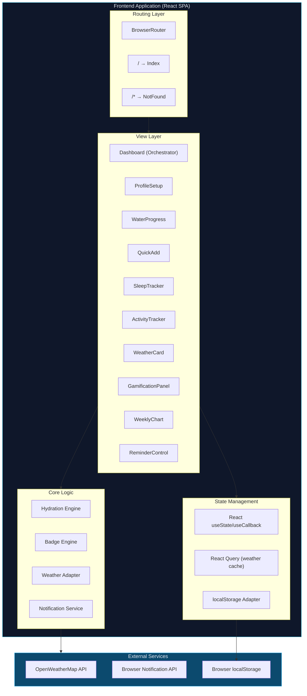
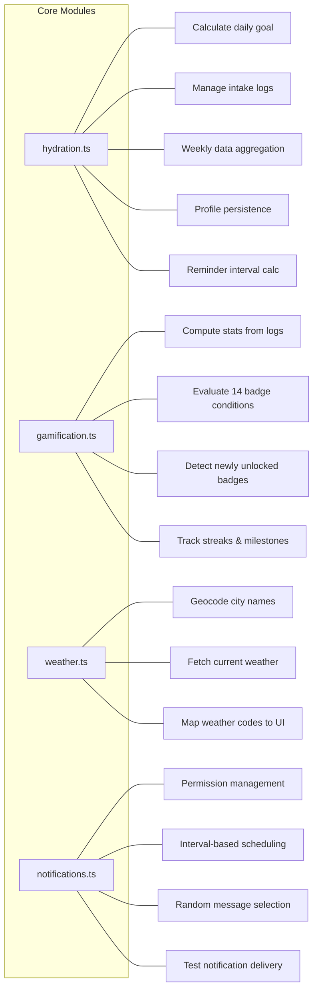
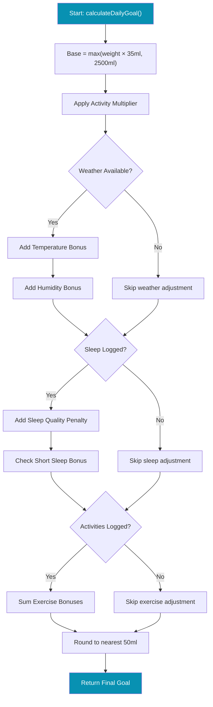
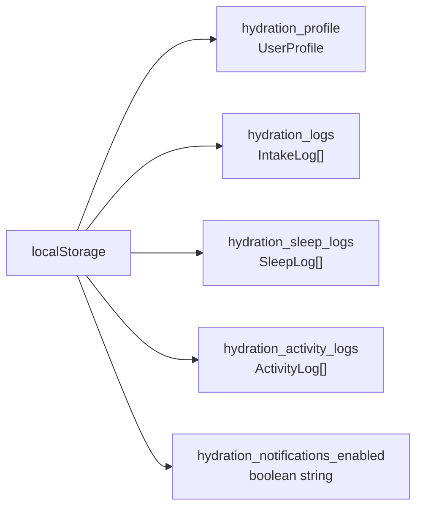
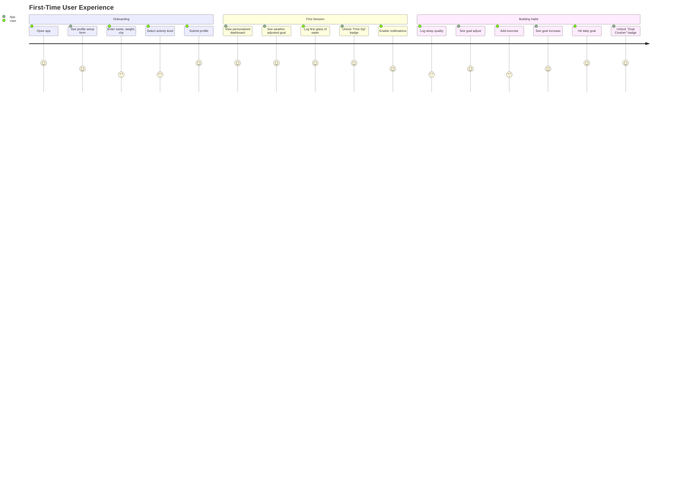
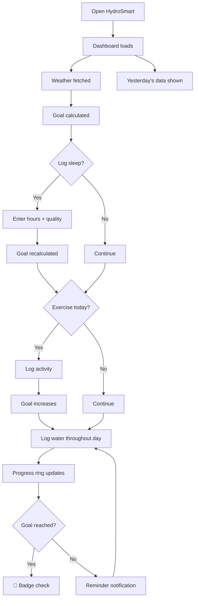
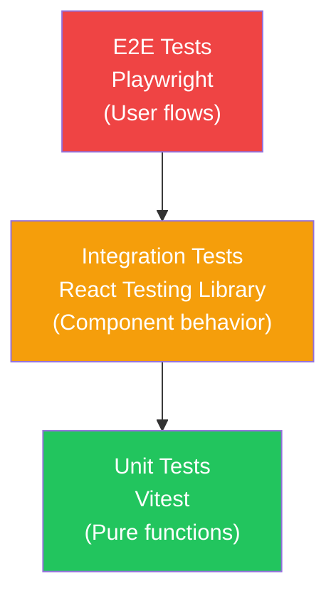

# 📖 HydroSmart — Complete Project Documentation

## Table of Contents

1. [Project Overview](#1-project-overview)
2. [Problem Statement & Objectives](#2-problem-statement--objectives)
3. [System Design & Architecture](#3-system-design--architecture)
4. [Tech Stack & Justification](#4-tech-stack--justification)
5. [Module Breakdown](#5-module-breakdown)
6. [Core Algorithm — Hydration Engine](#6-core-algorithm--hydration-engine)
7. [Feature Documentation](#7-feature-documentation)
8. [Data Models & Schemas](#8-data-models--schemas)
9. [UI/UX Design System](#9-uiux-design-system)
10. [Workflow & User Journeys](#10-workflow--user-journeys)
11. [Integration Details](#11-integration-details)
12. [Testing Strategy](#12-testing-strategy)
13. [Deployment & DevOps](#13-deployment--devops)
14. [Pros, Cons & Trade-offs](#14-pros-cons--trade-offs)
15. [Performance Metrics](#15-performance-metrics)
16. [Troubleshooting Guide](#16-troubleshooting-guide)
17. [Future Roadmap](#17-future-roadmap)

---

## 1. Project Overview

### What is HydroSmart?

HydroSmart is an **intelligent, weather-adaptive hydration tracking application** that computes personalized daily water intake goals using a multi-factor algorithm. It considers body weight, real-time weather conditions, sleep quality, exercise intensity, and lifestyle activity level.

### The Vision

Transform passive water tracking into an **active, adaptive health companion** that evolves with the user's daily life — not just a counter, but an intelligent system that understands *why* your hydration needs change.

### Key Differentiators

| Feature | Traditional Trackers | HydroSmart |
|---------|---------------------|-----------|
| Daily Goal | Static (e.g., "8 glasses") | Dynamic, multi-factor algorithm |
| Weather | ❌ Not considered | ✅ Real-time temp & humidity |
| Sleep | ❌ Not considered | ✅ Quality & duration impact |
| Exercise | Basic calorie link | ✅ Intensity × duration formula |
| Engagement | Simple logging | ✅ Gamification with 14 badges |
| Reminders | Fixed intervals | ✅ Calculated from wake/sleep hours |

---

## 2. Problem Statement & Objectives

### Problem

The majority of people are chronically dehydrated. Existing water tracking apps use a **static, one-size-fits-all** recommendation (typically "drink 8 glasses a day") that ignores:

- Climate and weather variations
- Physical activity differences
- Sleep quality impacts on hydration
- Individual body composition
- Daily lifestyle changes

### Objectives

1. **Personalize** hydration targets using 5+ dynamic factors
2. **Adapt** goals in real-time based on weather and daily activities
3. **Motivate** consistent hydration through gamification
4. **Remind** users at scientifically calculated intervals
5. **Visualize** progress through engaging, responsive UI
6. **Educate** users about hydration with contextual tips

### Success Criteria

- ✅ Dynamic goal recalculates when factors change
- ✅ Weather data integrates seamlessly
- ✅ Sleep and activity tracking modifies goals
- ✅ Badge system rewards consistency
- ✅ Responsive across all device sizes
- ✅ Zero crashes or data loss

---

## 3. System Design & Architecture

### System Architecture Diagram



### Design Patterns Used

| Pattern | Where | Purpose |
|---------|-------|---------|
| **Container/Presentational** | Dashboard vs WaterProgress | Separate logic from rendering |
| **Callback Props** | onAdd, onUpdate, onComplete | Child-to-parent communication |
| **Compound Components** | SleepTracker (collapsed/expanded) | Multi-state UI patterns |
| **Error Boundary** | ErrorBoundary wrapping App | Graceful error recovery |
| **Adapter** | weather.ts normalizing API responses | Decouple from external format |
| **Strategy** | Activity multiplier lookup tables | Configurable behavior mapping |

---

## 4. Tech Stack & Justification

### Frontend Framework: React 18

**Why React?**
- Component composition model fits our modular UI
- Hooks API (`useState`, `useCallback`, `useEffect`) provides clean state management
- Massive ecosystem for UI components (shadcn/ui, Radix)
- React 18's concurrent features for smooth animations

**Why NOT Next.js/Remix?**
- No server-side rendering needed — pure client-side SPA
- No API routes needed — weather API called directly
- Simpler deployment as static files

### Build Tool: Vite 5

**Why Vite?**
- Sub-second HMR during development
- ES module-based dev server — no bundling during dev
- Optimized production builds with Rollup
- First-class TypeScript support

### Styling: Tailwind CSS 3

**Why Tailwind?**
- Utility-first approach matches component-based architecture
- Built-in responsive breakpoints (`sm:`, `md:`, `lg:`)
- CSS purging eliminates unused styles (tiny production bundle)
- Design token system via CSS custom properties

### Animation: Framer Motion 12

**Why Framer Motion?**
- Declarative animation API (`initial`, `animate`, `exit`)
- Spring physics for natural-feeling motion
- `AnimatePresence` for enter/exit transitions
- Layout animations for expanding/collapsing sections

### Charts: Recharts 2

**Why Recharts?**
- Built on React — composable chart components
- Responsive container support
- Tooltip and reference line for goal visualization
- Small bundle size compared to D3 alternatives

### UI Primitives: shadcn/ui + Radix

**Why shadcn/ui?**
- Copy-paste components (no npm dependency lock-in)
- Built on Radix for accessibility (ARIA, keyboard nav)
- Fully customizable with Tailwind
- 40+ production-ready components

---

## 5. Module Breakdown

### Module Responsibility Matrix



### hydration.ts (193 lines)

The **heart of the application**. Contains:

- **Type definitions**: `UserProfile`, `WeatherData`, `IntakeLog`, `SleepLog`, `ActivityLog`
- **Algorithm constants**: Base intake, activity multipliers, exercise additions, sleep adjustments
- **Pure functions**: `calculateDailyGoal()`, `getReminderInterval()`, `getTemperatureLevel()`
- **Side-effect functions**: `addIntakeLog()`, `getTodayLogs()`, `getWeeklyData()`, `getProfile()`, `saveProfile()`

### gamification.ts (128 lines)

The **engagement engine**. Contains:

- 14 badges across 4 tiers (bronze → diamond)
- `computeStats()`: Aggregates all logs into streak, volume, and milestone metrics
- `getNewlyUnlockedBadges()`: Diffs previous and current stats to detect unlocks
- Streak algorithm: Counts consecutive days where intake ≥ goal

### weather.ts (51 lines)

The **external data adapter**. Contains:

- Two-step API call: geocoding → weather forecast
- Weather code → human description mapping
- Weather code → emoji icon mapping

### notifications.ts (78 lines)

The **reminder scheduler**. Contains:

- Feature detection and permission management
- `setInterval`-based scheduling with configurable period
- 6 randomized notification messages
- Test notification for verification

---

## 6. Core Algorithm — Hydration Engine

### Algorithm Specification



### Detailed Calculation Tables

#### Activity Level Multipliers

| Level | Multiplier | Description | Example Goal Impact (70kg) |
|-------|-----------|-------------|---------------------------|
| Sedentary | 1.0× | Desk job, minimal movement | 2,450ml → 2,450ml |
| Light | 1.1× | Light walks, household tasks | 2,450ml → 2,695ml |
| Moderate | 1.2× | Regular exercise 3-4x/week | 2,450ml → 2,940ml |
| Active | 1.35× | Daily exercise, physical job | 2,450ml → 3,308ml |
| Intense | 1.5× | Athlete, heavy manual labor | 2,450ml → 3,675ml |

#### Temperature Adjustments

| Temperature Range | Additional Intake |
|-------------------|-------------------|
| ≤ 25°C | +0ml |
| 25–30°C | +25ml per °C above 25 |
| > 30°C | +50ml per °C above 30 |

#### Humidity Adjustments

| Humidity | Additional Intake |
|----------|-------------------|
| < 30% | +300ml (dry air dehydrates) |
| 30–50% | +150ml |
| > 50% | +0ml |

#### Sleep Quality Adjustments

| Quality | Additional Intake | Reasoning |
|---------|-------------------|-----------|
| Poor | +300ml | Body recovery needs more fluids |
| Fair | +150ml | Mild dehydration from restless sleep |
| Good | +0ml | Normal hydration baseline |
| Excellent | -100ml | Well-rested body is efficient |

Additional: Sleep < 6 hours → +200ml regardless of quality.

#### Exercise Adjustments

| Intensity | Per 30 Minutes | 1-Hour Session |
|-----------|---------------|----------------|
| Light | +200ml | +400ml |
| Moderate | +400ml | +800ml |
| Vigorous | +600ml | +1,200ml |

Formula: `extraMl = basePerSession × (durationMin / 30)`

### Reminder Interval Calculation

```
awakeMinutes = (sleepHour × 60 + sleepMin) - (wakeHour × 60 + wakeMin)
glasses = ceil(goalMl / 250)
intervalMinutes = floor(awakeMinutes / glasses)
```

**Example**: Wake 7:00, Sleep 23:00, Goal 3000ml
- Awake: 960 min, Glasses: 12, Interval: 80 min (every 1h 20m)

---

## 7. Feature Documentation

### 7.1 Profile Setup

**Purpose**: Collect user data for personalized goal calculation.

**Fields**:
| Field | Type | Validation | Used For |
|-------|------|-----------|----------|
| Name | string | Required | Greeting display |
| Weight | number (kg) | > 0 | Base hydration calc |
| Age | number | > 0 | Future health adjustments |
| City | string | Required | Weather API lookup |
| Wake Time | time | HH:MM | Reminder scheduling |
| Sleep Time | time | HH:MM | Reminder scheduling |
| Activity Level | enum | 5 options | Goal multiplier |

### 7.2 Water Progress Ring

**Purpose**: Visual representation of daily progress.

**Implementation**: SVG circle with animated `stroke-dashoffset`.
- Radius dynamically calculated
- Percentage displayed in center
- Color transitions: primary → accent (on completion)
- Framer Motion spring animation

### 7.3 Quick Add

**Purpose**: Fast water intake logging.

**Preset amounts**: 150ml (small), 250ml (glass), 500ml (bottle)
**Custom amount**: Inline input field (replaces native `prompt()` for mobile UX)
**On submit**: Adds to localStorage, triggers Dashboard refresh

### 7.4 Sleep Tracker

**Purpose**: Log sleep data that impacts hydration goals.

**Inputs**:
- Hours slider: 2h–12h (0.5h steps)
- Quality selector: Poor / Fair / Good / Excellent (2×2 grid)

**Impact on goal**:
- Poor quality: +300ml
- Short sleep (<6h): +200ml
- Excellent quality: -100ml

**Persistence**: `hydration_sleep_logs` in localStorage (one entry per day, overwritable)

### 7.5 Activity Tracker

**Purpose**: Log exercises that increase hydration needs.

**Activity types**: Walking, Running, Cycling, Gym, Swimming, Yoga, Sports, Other
**Duration**: 10–180 minutes slider (5-min steps)
**Intensity**: Light / Moderate / Vigorous

**Impact on goal**: Calculated per session based on intensity × duration
**Features**: Multiple activities per day, delete individual entries

### 7.6 Weather Integration

**Purpose**: Adjust goals based on real-time climate.

**Data displayed**: Temperature (°C), humidity (%), weather description, city name
**Refresh**: Manual refresh button in header
**Fallback**: "Could not fetch weather. Using base recommendation."

### 7.7 Gamification System

**Purpose**: Drive long-term engagement through achievements.

**Badge categories**:
1. **Streak badges** (3, 7, 14, 30 days)
2. **Volume badges** (10L, 50L, 100L total)
3. **Daily badges** (First Sip, Halfway, Goal Crusher, Overachiever)
4. **Milestone badges** (Week One, Monthly, 10 Goals)

**Unlock detection**: Compares previous stats snapshot with current; shows toast for new unlocks.

### 7.8 Reminder System

**Purpose**: Periodic hydration notifications.

**Technology**: Browser Notification API
**Scheduling**: `setInterval` with calculated period
**Smart timing**: Only fires when document is hidden (tab backgrounded)
**Messages**: 6 randomized messages to prevent notification fatigue

### 7.9 Weekly Analytics

**Purpose**: 7-day historical view of water intake.

**Implementation**: Recharts BarChart with:
- Bars showing daily intake (ml)
- ReferenceLine showing current goal
- Responsive container
- Custom tooltip

---

## 8. Data Models & Schemas

### TypeScript Interface Definitions

```typescript
// User profile — persisted in localStorage
interface UserProfile {
  name: string;           // Display name
  weight: number;         // kg — used for base calculation
  age: number;            // years — future use
  city: string;           // Weather API lookup
  wakeTime: string;       // "HH:MM" — reminder scheduling
  sleepTime: string;      // "HH:MM" — reminder scheduling
  activityLevel: ActivityLevel; // Goal multiplier
}

type ActivityLevel = "sedentary" | "light" | "moderate" | "active" | "intense";

// Water intake entry
interface IntakeLog {
  id: string;             // crypto.randomUUID()
  amount: number;         // milliliters
  timestamp: string;      // ISO 8601
}

// Daily sleep record
interface SleepLog {
  id: string;
  date: string;           // "YYYY-MM-DD"
  hours: number;          // 2.0 – 12.0
  quality: "poor" | "fair" | "good" | "excellent";
}

// Exercise entry
interface ActivityLog {
  id: string;
  type: string;           // "walking" | "running" | etc.
  durationMin: number;    // 10 – 180
  intensity: "light" | "moderate" | "vigorous";
  timestamp: string;      // ISO 8601
}

// Normalized weather response
interface WeatherData {
  temp: number;           // Celsius (rounded)
  humidity: number;       // Percentage
  description: string;    // "Clear sky", "Rainy", etc.
  icon: string;           // Emoji
  city: string;           // Resolved city name
}

// Aggregated statistics for gamification
interface HydrationStats {
  currentStreak: number;
  longestStreak: number;
  totalDaysTracked: number;
  totalLiters: number;
  goalsHitCount: number;
  todayGlasses: number;
  todayMl: number;
  goalMl: number;
}

// Achievement badge definition
interface Badge {
  id: string;
  name: string;
  emoji: string;
  description: string;
  condition: (stats: HydrationStats) => boolean;
  tier: "bronze" | "silver" | "gold" | "diamond";
}
```

### localStorage Key Map



---

## 9. UI/UX Design System

### Color Palette

| Token | HSL Value | Usage |
|-------|-----------|-------|
| `--primary` | 192 82% 45% | Main brand color (teal/cyan) |
| `--accent` | 168 70% 42% | Success states, completion |
| `--background` | 195 30% 97% | Page background |
| `--foreground` | 200 50% 10% | Primary text |
| `--muted-foreground` | 200 15% 50% | Secondary text |
| `--water-light` | 195 85% 92% | Light water surfaces |
| `--water-deep` | 200 80% 50% | Deep water accents |
| `--success` | 152 60% 45% | Positive feedback |
| `--warning` | 38 92% 55% | Caution states |
| `--hot` | 15 85% 55% | Heat indicators |
| `--destructive` | 0 72% 55% | Error states |

### Typography

| Usage | Font | Weight |
|-------|------|--------|
| Headings | Space Grotesk | 600–700 |
| Body | Plus Jakarta Sans | 400–500 |
| Labels | Plus Jakarta Sans | 500 |
| Data | Plus Jakarta Sans | 700 |

### Component Design Language

- **Cards**: Glass morphism (backdrop-blur, semi-transparent backgrounds)
- **Buttons**: Rounded corners (xl/2xl), minimum 44px touch targets
- **Inputs**: Rounded (xl), clear focus rings
- **Animations**: Spring physics, 0.3–0.5s duration
- **Spacing**: 4px grid, generous padding on mobile

### Responsive Breakpoints

| Breakpoint | Target | Adjustments |
|-----------|--------|-------------|
| 0–639px | Mobile phones | Single column, compact panels, 44px touch targets |
| 640–767px | Large phones / small tablets | Increased padding, larger text |
| 768px+ | Tablets and desktop | Centered max-width container |

---

## 10. Workflow & User Journeys

### First-Time User Journey



### Daily Returning User Flow



---

## 11. Integration Details

### OpenWeatherMap API Integration

**Endpoints Used**:

| Endpoint | Purpose | Parameters |
|----------|---------|-----------|
| `api.openweathermap.org/data/2.5/weather` | Fetch current weather by city name | `q={city}`, `appid={API_KEY}`, `units=metric` |

**Error Handling**:
- OpenWeatherMap API error / Network failure → caught in Dashboard, falls back to deterministic mock weather and updates tips.
- Invalid response → handled with safety try/catch and optional chaining.

**Weather Icon/Emoji Mapping**:

| Icon Code Prefix | Description | Icon |
|-----------|-------------|------|
| 01 | Clear sky | ☀️ |
| 02, 03, 04 | Clouds | ⛅ |
| 09, 10 | Rain | 🌧️ |
| 11 | Thunderstorm | ⛈️ |
| 13 | Snow | ❄️ |
| 50 | Mist/Fog | 🌫️ |

### Browser Notification API Integration

**Permission Flow**:
```
isNotificationSupported() → checks "Notification" in window
requestNotificationPermission() → Notification.requestPermission()
startReminders(intervalMin) → setInterval with document.hidden check
```

**Notification Options**:
- `icon`: `/favicon.ico`
- `tag`: `"hydration-reminder"` (prevents stacking)
- `onclick`: Focuses window and closes notification

---

## 12. Testing Strategy

### Testing Pyramid



### Test Coverage Areas

| Layer | Tool | What to Test |
|-------|------|-------------|
| **Unit** | Vitest | `calculateDailyGoal()`, `computeStats()`, `getReminderInterval()`, weather mapping |
| **Integration** | React Testing Library | Component rendering, user interactions, state updates |
| **E2E** | Playwright | Profile setup flow, water logging, badge unlocks, responsive behavior |

### Running Tests

```bash
# Unit & Integration tests
npm run test

# E2E tests
npx playwright test
```

### Verification Checklist

- [ ] Profile setup validates all fields
- [ ] Daily goal changes when sleep/activity is logged
- [ ] Water intake updates progress ring
- [ ] Weather fetch succeeds and updates UI
- [ ] Badges unlock at correct thresholds
- [ ] Notifications fire when tab is backgrounded
- [ ] App works on mobile viewports
- [ ] Error boundary catches runtime errors
- [ ] Weekly chart shows 7-day history
- [ ] Data persists across page reloads

---

## 13. Deployment & DevOps

### Build & Deploy

```bash
# Build production bundle
npm run build

# Preview production build locally
npm run preview
```

### Deployment Options

| Platform | Method | Config |
| **Vercel** | Git push deploy | Auto-detected as Vite |
| **Netlify** | Git push deploy | Build: `npm run build`, Dir: `dist` |
| **GitHub Pages** | Manual or CI | Set `base` in vite.config.ts |

### Environment Requirements

- No server needed — purely static files
- No environment variables required
- Requires OpenWeatherMap API key (using fallback simulation on error)
- HTTPS recommended for Notification API

---

## 14. Pros, Cons & Trade-offs

### Advantages

| Advantage | Details |
|-----------|---------|
| **No backend required** | Runs entirely in the browser, zero hosting costs |
| **API Fallback** | Automatic fallback simulation if API is rate-limited |
| **Instant setup** | No registration, no email, no OAuth |
| **Privacy-first** | All data stays on user's device |
| **Fast** | Vite + React = sub-second loads |
| **Offline-capable data** | localStorage persists without network |
| **Responsive** | Works on phones, tablets, desktops |
| **Accessible** | ARIA labels, keyboard navigation, screen reader support |
| **Engaging** | 14 badges keep users motivated |
| **Accurate goals** | 5-factor algorithm vs static "8 glasses" |

### Limitations

| Limitation | Mitigation |
| **No cross-device sync** | Future: Add database backend (e.g. Supabase, Firebase) |
| **localStorage limits** | ~5MB; sufficient for years of daily logging |
| **No data export** | Future: CSV/JSON export feature |
| **Weather-dependent** | Graceful fallback when API unavailable |
| **Single user** | Future: Multi-profile support |
| **No PWA offline** | Future: Service worker for full offline |
| **Browser notifications** | Not supported in all mobile browsers |

### Trade-off Decisions

| Decision | Alternative | Why Chosen |
|----------|------------|-----------|
| localStorage vs IndexedDB | IndexedDB is more powerful | localStorage is simpler, sufficient for current data volume |
| No state library | Redux, Zustand | Single container component, no deep prop drilling |
| Open-Meteo vs OpenWeatherMap | OpenWeatherMap was selected for city-based queries | Simplified request architecture (no separate geocoding) |
| Framer Motion vs CSS animations | CSS is lighter | Framer Motion provides spring physics and AnimatePresence |
| shadcn/ui vs Material UI | MUI is more complete | shadcn/ui is lighter, more customizable, Tailwind-native |

---

## 15. Performance Metrics

### Bundle Analysis (Production Build)

| Asset | Estimated Size | Contents |
|-------|---------------|----------|
| Vendor JS | ~150KB gzipped | React, React DOM, Radix, Recharts |
| App JS | ~30KB gzipped | Application code |
| CSS | ~15KB gzipped | Tailwind (purged) + custom styles |
| Fonts | ~60KB | Plus Jakarta Sans + Space Grotesk (WOFF2) |
| **Total** | **~255KB gzipped** | Full application |

### Runtime Performance

| Metric | Target | Strategy |
|--------|--------|----------|
| First Contentful Paint | < 1.5s | Vite optimized chunks |
| Time to Interactive | < 2.0s | Minimal JS, no heavy computation |
| Re-render cost | < 16ms | useCallback memoization |
| localStorage read | < 1ms | JSON parse on mount only |
| Weather API call | < 2s | Single fetch, cached by React Query |

---

## 16. Troubleshooting Guide

### Common Issues

| Issue | Cause | Solution |
|-------|-------|---------|
| Weather not loading | City name not found | Try a larger/known city name |
| Notifications not working | Permission denied | Check browser notification settings |
| Progress not updating | stale component state | Refresh the page |
| Goal seems too high | Multiple exercise entries | Review activity tracker, remove duplicates |
| Data lost | localStorage cleared | Browser clear data or private mode |
| App blank screen | JavaScript error | Check console; ErrorBoundary should catch |

### Data Recovery

```javascript
// View all stored data in browser console
console.log('Profile:', JSON.parse(localStorage.getItem('hydration_profile')));
console.log('Logs:', JSON.parse(localStorage.getItem('hydration_logs')));
console.log('Sleep:', JSON.parse(localStorage.getItem('hydration_sleep_logs')));
console.log('Activities:', JSON.parse(localStorage.getItem('hydration_activity_logs')));
```

### Reset Application

```javascript
// Clear all HydroSmart data (run in browser console)
['hydration_profile', 'hydration_logs', 'hydration_sleep_logs', 
 'hydration_activity_logs', 'hydration_notifications_enabled']
  .forEach(key => localStorage.removeItem(key));
location.reload();
```

---

## 17. Future Roadmap

### Short-Term (v1.1)

- [ ] PWA with service worker for offline support
- [ ] Data export (CSV/JSON)
- [ ] Custom reminder sounds
- [ ] Dark mode auto-detection improvements

### Medium-Term (v2.0)

- [ ] Database backend integration for cross-device sync
- [ ] User authentication (email, Google, Apple)
- [ ] Social features (challenges, leaderboards)
- [ ] AI-powered hydration insights
- [ ] Food-based hydration tracking

### Long-Term (v3.0)

- [ ] Wearable device integration (Apple Watch, Fitbit)
- [ ] Health app sync (Apple Health, Google Fit)
- [ ] Hydration coaching with ML models
- [ ] Multi-language support (i18n)
- [ ] Team/family hydration tracking

---

<p align="center">
  <strong>HydroSmart v1.0</strong> — Intelligent Hydration Tracking<br/>
  Built with React 18 • TypeScript 5 • Tailwind CSS 3 • Vite 5<br/>
  <em>Stay hydrated, stay healthy! 💧</em>
</p>
